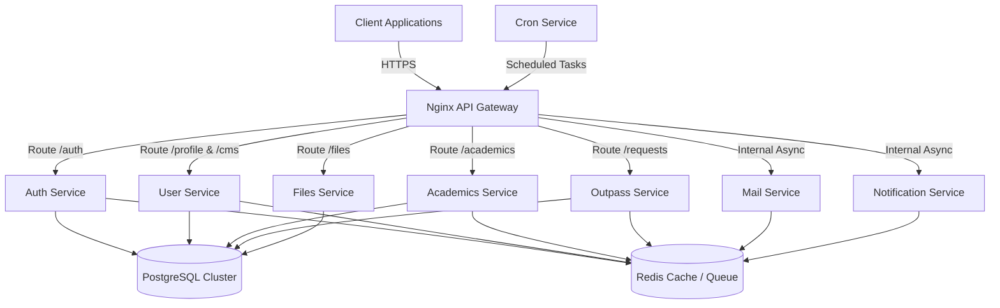

<div align="center">
  

# UniZ - University Management System

**A modern, scalable, and high-performance microservices ecosystem for enterprise university management.**

[](https://nodejs.org/)
[](https://www.typescriptlang.org/)
[](https://www.docker.com/)
[](https://kubernetes.io/)
[](https://www.postgresql.org/)
[](https://redis.io/)

[](https://github.com/uniz-rguktong/uniz-master/actions/workflows/docker-build-push.yml)

</div>

---

## 📖 Overview

**UniZ** is a comprehensive, enterprise-grade university management platform designed to consolidate fragmented systems into a unified, high-performance ecosystem. Built from the ground up using a microservices architecture, UniZ provides seamless integration across various university operations including academics, student life, administration, and digital communication.

By leveraging a centralized Monorepo architecture (`uniz-master`), we ensure deterministic builds, streamlined CI/CD pipelines, and robust infrastructure orchestration, while maintaining modular runtime deployments.

## ✨ Key Features

- **Centralized API Gateway**: Nginx-backed ingress routing with unified authentication, rate-limiting, and CORS management.
- **Robust Authentication**: JWT-based stateless authentication with OTP password recovery flows and role-based access control (RBAC).
- **Academic Management**: Comprehensive tracking of grades, attendance, and subjects, with support for bulk data ingestion via Excel.
- **Outpass & Requests System**: Hierarchical approval workflows (Caretaker -> Warden -> Director) for student leaves and grievances.
- **Content Management System (CMS)**: Dynamic control over public banners, university notifications, and administrative updates.
- **Automated Notifications & Mailing**: Integrated asynchronous email and notification services via Redis message queues.
- **Scheduled Cron Jobs**: Automated system maintenance, data synchronization, and scheduled event triggers.

## 🏗 Architecture

UniZ implements a bounded-context microservices pattern, orchestrated via Docker Compose for local environments and Kubernetes for production.



## 📂 Repository Structure

The `uniz-master` repository is structured to manage the entire ecosystem efficiently:

- **`apps/`**: Contains the source code for all microservices.
  - `uniz-gateway/`: Core API routing and status aggregation.
  - `uniz-auth/`: Identity and access management.
  - `uniz-user/`: User profiles, roles, and CMS data.
  - `uniz-academics/`: Educational data, grades, and attendance.
  - `uniz-outpass/`: Student requests, outpasses, and grievances.
  - `uniz-files/`: Secure cloud storage integration and file processing.
  - `uniz-mail/`: Transactional email delivery system.
  - `uniz-notifications/`: In-app alerts and push notifications.
  - `uniz-cron/`: Scheduled tasks and maintenance scripts.
  - `uniz-portal/`: Administration frontend application.
- **`infra/`**: Infrastructure configuration.
  - `core-infra/`: Docker Compose, Nginx configurations, deployment scripts, and Postman collections.
- **`docs/`**: Technical specification documents, API contracts, and architecture blueprints.
- **`scripts/`**: Automation scripts for development, data seeding, and CI/CD operations.

## 🛠 Technology Stack

### Backend Infrastructure

- **Runtime**: Node.js 20.x, TypeScript 5.x
- **Frameworks**: Express.js
- **Database**: PostgreSQL 17 (Relational persistence)
- **Cache & Queues**: Redis 7
- **ORM**: Prisma

### Frontend Portals

- **Framework**: React 18, Vite
- **Styling**: TailwindCSS

### DevOps & Deployment

- **Containerization**: Docker, Docker Compose
- **Orchestration**: Kubernetes (K3s)
- **Proxy/Ingress**: Nginx 1.25
- **CI/CD**: GitHub Actions, Shell Scripting Registry
- **Testing**: Jest, Supertest, Axios-based E2E Scripts

## 🚀 Getting Started

### Prerequisites

Ensure you have the following installed on your local machine:

- Node.js (v20 or higher)
- Docker & Docker Compose
- Git & GitHub CLI (`gh`)

### Local Development Setup

1. **Clone the Repository**:

   ```bash
   git clone https://github.com/uniz-rguktong/uniz-master.git
   cd uniz-master
   ```

2. **Install Global Dependencies**:

   ```bash
   npm install
   npm run install:all
   ```

3. **Configure Environment Variables**:

   ```bash
   # Copy the example environment file
   cp infra/core-infra/.env.example infra/core-infra/.env
   # Ensure you populate the necessary secrets in the .env file.
   ```

4. **Initialize Local Infrastructure (Databases)**:

   ```bash
   # Starts Postgres and Redis locally
   npm run setup
   npm run db:reset-migrate
   ```

5. **Start the Microservices Ecosystem**:

   ```bash
   # Launches all services in development mode
   npm run dev
   ```

6. **Run E2E Verification Tests**:
   ```bash
   npm run test
   ```

## 🔒 Security & Data Integrity

UniZ takes security seriously. All microservices are isolated within internal Docker networks, exposing only the Gateway port. JWT secrets are rotated natively, and all inter-service communication requires strict payload verification and origin validation.

---

<div align="center">
  <p><b>UniZ Systems Operations - 2026</b></p>
  <p><i>Building the digital backbone for educational administration.</i></p>
</div>
