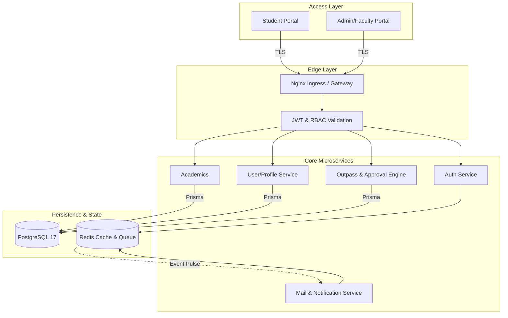

# UniZ | University Intelligence Engine

<<<<<<< HEAD
=======
[](https://github.com/uniz-rguktong/uniz-master/actions/workflows/github-code-scanning/codeql)
[](https://github.com/uniz-rguktong/uniz-master/actions/workflows/copilot-pull-request-reviewer/copilot-pull-request-reviewer)
>>>>>>> feature/seating-and-ui-polish
[](https://github.com/uniz-rguktong/uniz-master/actions/workflows/deploy.yml)


> **UNIZ SYSTEMS OPERATIONS 2026**
> _The digital backbone for enterprise-scale educational administration, built on a robust, self-healing microservices architecture._

## High-Performance Ecosystem Architecture

UniZ is a monorepo-managed microservices ecosystem designed for high availability, low latency, and enterprise-grade security. The system runs on a K3s cluster, ensuring automated scaling and resilience.



## Key Innovation: Edge-First Security & Self-Healing

1.  **Edge Gateway**: Centralized Nginx routing with edge-level CORS management and SSL termination, isolating internal services in a private Kubernetes network.
2.  **Horizontal Scalability**: Leveraging K3s HPA to dynamically provision resources during traffic spikes.
3.  **Atomic Data Integrity**: Prisma-backed PostgreSQL 17 cluster ensuring ACID compliance across academic workflows.
4.  **Asynchronous Efficiency**: Moving heavy tasks like distribution and auditing to Redis-backed background workers.

## Technology Stack

| Layer                | Technology           | Purpose                                              |
| :------------------- | :------------------- | :--------------------------------------------------- |
| **Logic**            | Node.js (TypeScript) | Scalable, type-safe microservice implementation.     |
| **Data Engine**      | PostgreSQL 17        | Relational storage for critical academic records.    |
| **ORM**              | Prisma               | Type-safe database access and automated migrations.  |
| **Caching/MQ**       | Redis                | Session persistence and asynchronous job queuing.    |
| **Containerization** | Docker               | Isolated, reproducible service environments.         |
| **Orchestration**    | K3s (Kubernetes)     | Production cluster management and auto-scaling.      |
| **CI/CD**            | GitHub Actions       | Automated build, test, and VPS deployment pipelines. |

### 🚀 Master Setup (All Systems)

Run the entire UniZ mission control center with a single setup command. Works natively on **macOS, Linux, and Windows (WSL/Git Bash)**:

1. **Auto-Install & Infra**:
   ```bash
   npm run setup:local
   ```
2. **Seed Ecosystem**:
   ```bash
   npm run seed:local
   ```
3. **Launch All**:
   ```bash
   npm run dev:all
   ```

**Test Credentials:**

- **Webmaster**: `webmaster` / `password123`
- **Faculty/HOD**: `hod_cse` / `password123`
- **Student**: (Use bulk onboarding / seeder to create)

## 🔐 Environment & Security Strategy

UniZ uses a "Shielded Vault" pattern to isolate Local and Production environments:

- **Local Development**: Managed via `secrets.env` in the root. The `npm run setup:local` command automatically propagates this to all microservice sub-directories. This file is git-ignored.
- **Production (VPS)**: Sourced from `/root/uniz-secrets.env` on the VPS host. The `deploy.sh` script reads these values over SSH and injects them directly into Kubernetes Secrets.
- **Airgap**: Production credentials **never** touch the Git history or your local machine's environment. Changes to production ENV must be made directly on the VPS master file.

---

---

<p align="center">
  Built with love by <b>SreeCharan</b> | 2026
</p>
