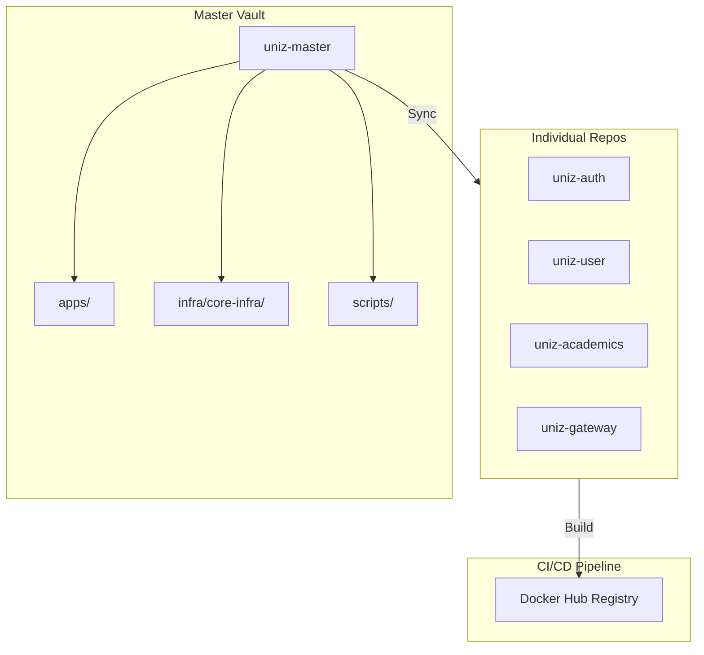

# UniZ - University Management System Master Vault


> **UniZ ENTERPRISE INFRASTRUCTURE 2026**
> _Consolidating fragmented microservices into a unified, high-performance university management ecosystem._

[](https://github.com/uniz-rguktong/uniz-master/actions/workflows/docker-build-push.yml)

## Structuralized Architecture Overview

The Master Vault serves as the central orchestration point for the entire UniZ ecosystem. It utilizes a Monorepo-to-MultiRepo synchronization model, ensuring that while code is centralized for development, production deployments remain modular and scalable.



## Monorepo Organization

The root codebase is structuralized for enterprise-grade management:

- **apps/**: Contains all 10 frontend and backend microservices. Each is a standalone repository synced via the vault.
- **infra/core-infra/**: Centralized Kubernetes manifests, Docker Compose files, and PostgreSQL/Redis configuration.
- **docs/**: Technical blueprints, scaling reports, and project history.
- **scripts/**: Automation tools for synchronization, service management, and stress testing.
- **postman/**: Complete API collection for developer onboarding.
- **tests/**: Global end-to-end integration tests.

## Technology Stack

| Layer        | Technology            | Purpose                                           |
| :----------- | :-------------------- | :------------------------------------------------ |
| **Backend**  | `Node.js` / `Express` | Microservices runtime and API framework.          |
| **Frontend** | `React` / `Vite`      | High-performance student and admin portals.       |
| **Database** | `PostgreSQL`          | Multi-tenant relational data persistence.         |
| **Caching**  | `Redis`               | Distributed session management and rate limiting. |
| **DevOps**   | `Docker` / `K3s`      | Containerization and Kubernetes orchestration.    |
| **Cloud**    | `Vercel`              | Serverless deployment for entry-points and APIs.  |

## Getting Started

### Prerequisites

- Node.js 20+
- Docker & Docker Compose
- GitHub CLI (for synchronization)

### Local Development

1. **Install Dependencies**:
   ```bash
   npm install && npm run install:all
   ```
2. **Start Services**:
   ```bash
   npm run dev
   ```
   This will initialize all microservices and the local gateway.

---

<p align="center">
  Corporate Technical Infrastructure - internal Use Only
</p>
