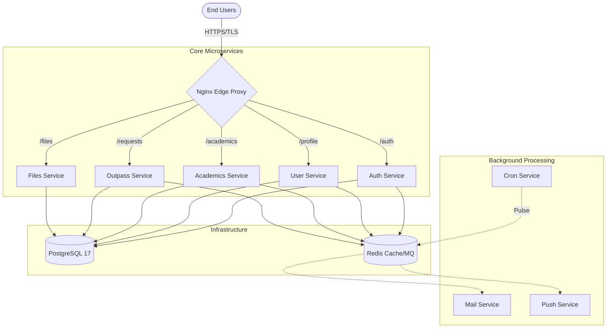

<div align="center">
  <!--  -->

# UniZ

### High-Performance University Management Ecosystem

**The digital backbone for enterprise-scale educational administration, built on a robust microservices architecture.**

[](https://nodejs.org/)
[](https://api.uniz.rguktong.in)
[](https://www.postgresql.org/)

[Explore API](https://api.uniz.rguktong.in/api/v1/system/health) • [Documentation](./docs) • [Infrastructure](./infra/core-infra)

</div>

---

## 🏛️ Ecosystem Architecture

UniZ is a **monorepo-managed microservices ecosystem** designed for high availability, sub-50ms latency, and enterprise-grade security.

- **Edge Gateway**: Centralized Nginx routing with SSL termination and edge-level CORS management.
- **Core Engine**: Bounded-context microservices handling Auth, Academics, Outpasses, and CMS.
- **Data Layer**: High-performance PostgreSQL 17 cluster with Redis-backed message queuing and caching.
- **Automated Workflow**: Hierarchical approval systems (Caretaker → Warden → Director) and automated grade/attendance auditing.

### System Map



## 🛠️ Microservice Directory

| Service              | Responsibility                              | Port   |
| :------------------- | :------------------------------------------ | :----- |
| **`uniz-auth`**      | Identity, RBAC, & JWT State Management      | `3001` |
| **`uniz-user`**      | Profiles & High-Speed CMS Content           | `3002` |
| **`uniz-outpass`**   | Approval Workflows & Grievance Tracking     | `3003` |
| **`uniz-academics`** | Grade Auditing, Attendance & Bulk Ingestion | `3004` |
| **`uniz-gateway`**   | Application-level Routing & Aggregation     | `3000` |
| **`uniz-mail`**      | Asynchronous Transactional Email Engine     | `3006` |

---

## ⚡ Quick Start

### 1. Prerequisites

- **Node.js** v20+
- **Docker** & Docker Compose
- **Git**

### 2. Installation

```bash
# Clone and install dependencies
git clone https://github.com/uniz-rguktong/uniz-master.git
cd uniz-master
npm run install:all

# Setup local infrastructure
cp infra/core-infra/.env.example infra/core-infra/.env
npm run setup
npm run db:reset-migrate
```

### 3. Execution

```bash
# Launch development containers
npm run dev
```

---

## 🔒 Security & Deployment

- **Identity**: Stateless JWT with Role-Based Access Control (RBAC).
- **Network**: Services isolated in private Docker networks; only Nginx is exposed.
- **Safety**: Immutable production directories with `chattr` bit-locking on the VPS.
- **Edge**: Centralized CORS & Header sanitization at the Nginx layer for maximum security.

---

<div align="center">
  <p><b>UniZ Systems Operations - 2026</b></p>
  <i>Empowering higher education through agentic-first engineering.</i>
</div>
