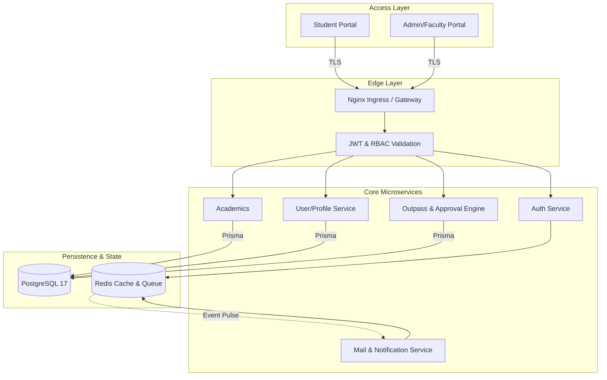

# UniZ | University Intelligence Engine

[](https://github.com/uniz-rguktong/uniz-master/actions/workflows/deploy.yml)


> **UNIZ SYSTEMS OPERATIONS 2026**
> _The digital backbone for enterprise-scale educational administration, built on a robust, self-healing microservices architecture._

## Repo map

Canonical layout: **[STRUCTURE.md](STRUCTURE.md)**.

| Path | Role |
|------|------|
| `apps/` · `packages/` | Workspaces (stable — do not rename for CI/K3s) |
| `docker/local/` | Laptop Compose demo (`make up`) |
| `docker/prod/` | CI → GHCR → **K3s** images only |
| `scripts/{ci,deploy,local,ops}/` | Audience-grouped tooling |
| `docs/local/` | Contributor setup |
| `infra/` | Kubernetes manifests |

**Production is K3s.** Docker Compose never runs on the VPS.

## Quick start (contributors)

Clone and pick one local path. You do **not** need production passwords or VPS access.

### A — Full stack in Docker (fastest demo)

Start Docker before running the stack:

```bash
# macOS with Colima
colima start

# Docker Desktop users: open Docker Desktop and wait until it is running
docker info
```

If `docker info` reports a missing `.colima/default/docker.sock`, Colima is not
running. Start it with `colima start`, then retry.

```bash
git clone https://github.com/uniz-rguktong/uniz-master.git
cd uniz-master
cp .env.example .env
make up && make seed
```

Alternatively, run `npm run docker:up && npm run docker:seed`.

> Copy only the commands. A line beginning with `#` is explanatory text; some
> Zsh configurations treat a pasted `#` line as a command and print
> `zsh: command not found: #`.

| What | Where |
|------|--------|
| Portal | http://localhost:8080 (or `WEB_PORT`) |
| API (via portal) | http://localhost:8080/api/v1 |
| Gateway direct | http://localhost:3000/api/v1 |
| Sign-in | `webmaster` / `password123` |

Details: [docker/README.md](docker/README.md).

### B — Hot-reload development

```bash
cp secrets.env.example secrets.env
npm run setup:local
npm run seed:local    # first time
npm run dev:all
```

| What | Where |
|------|--------|
| Portal | http://localhost:5173 |
| API gateway | http://localhost:3000/api/v1 |
| Sign-in (after seed) | `webmaster` / `password123` |

Full guide: [docs/local/LOCAL_SETUP.md](docs/local/LOCAL_SETUP.md) · [CONTRIBUTING.md](CONTRIBUTING.md).

`secrets.env.example` and `.env.example` ship **dev-only** placeholders (local DB, test Turnstile, dummy JWT, Cloudinary placeholders). Never commit `secrets.env` or `.env`, and never paste production credentials into the repo.

## Production (maintainers)

Push to `main` → GitHub Actions builds with [`docker/prod/Dockerfile.service`](docker/prod/Dockerfile.service) → GHCR → `kubectl` on K3s.

- Deploy entry: [`.github/workflows/deploy.yml`](.github/workflows/deploy.yml)
- Migrations on VPS: `scripts/deploy/prisma-migrate-deploy-all.sh` (not Compose `db push`)
- Local auto-migrate (`UNIZ_AUTO_DB_PUSH`) is **Compose-only** and never set in K8s

## Architecture

UniZ is a monorepo microservices ecosystem for high availability and edge-first security on K3s.


```mermaid
graph TD
    subgraph Users ["Access Layer"]
        Student["Student Portal"]
        Admin["Admin/Faculty Portal"]
    end

    subgraph Edge ["Edge Layer"]
        Nginx["Nginx Ingress / Gateway"]
        Auth_Edge["JWT & RBAC Validation"]
    end

    subgraph Services ["Core Microservices"]
        Academics["Academics"]
        Auth["Auth Service"]
        Profiles["User/Profile Service"]
        Outpass["Outpass & Approval Engine"]
        Mail["Mail & Notification Service"]
    end

    subgraph Data ["Persistence & State"]
        PG[(PostgreSQL 17)]
        Redis[(Redis Cache & Queue)]
    end

    Student & Admin -->|TLS| Nginx
    Nginx --> Auth_Edge
    Auth_Edge --> Academics & Auth & Profiles & Outpass
    Academics & Profiles & Outpass -->|Prisma| PG
    Auth & Mail --> Redis
    Redis -.->|Event Pulse| Mail
```

1. **Edge Gateway** — Nginx routing, CORS, TLS; services on a private cluster network.
2. **Horizontal scale** — K3s HPA under traffic spikes.
3. **Data integrity** — Prisma + PostgreSQL 17 across academic workflows.
4. **Async work** — Redis-backed queues for mail, notifications, audits.

## Technology stack

| Layer | Technology | Purpose |
| :---- | :--------- | :------ |
| Logic | Node.js (TypeScript) | Type-safe microservices |
| Data | PostgreSQL 17 | Academic records |
| ORM | Prisma | Access + migrations |
| Cache / MQ | Redis | Sessions and jobs |
| Containers | Docker | Local Compose + GHCR images |
| Orchestration | K3s | Production only |
| CI/CD | GitHub Actions | Build, test, VPS deploy |

## Cloudinary (optional — uploads only)

The repo **does not** ship real Cloudinary credentials. For local upload testing, use **your own** keys in `secrets.env`:

```bash
CLOUDINARY_CLOUD_NAME=your_cloud_name
CLOUDINARY_UPLOAD_PRESET=your_upload_preset
VITE_CLOUDINARY_CLOUD_NAME=your_cloud_name
VITE_CLOUDINARY_UPLOAD_PRESET=your_upload_preset
```

Login, academics, and outpass work without Cloudinary. Never commit real keys.

## Environment & security

| Layer | Who | Secrets | In git? |
|-------|-----|---------|---------|
| Local hot-reload | Contributors | `secrets.env` from example | **No** |
| Local Compose | Contributors | `.env` from `.env.example` | **No** |
| Production | Maintainers | VPS `/root/uniz-secrets.env` + Actions secrets | **No** |
| Templates | Everyone | `secrets.env.example`, `.env.example` | **Yes** — placeholders |

**Maintainers** (VPS SSH):

```bash
npm run vault:vps:status
npm run vault:vps:list
npm run vault:vps:show -- KEY
npm run vault:vps -- reveal KEY
```

Do **not** put production passwords, API keys, or SSH private keys in the README, issues, or PRs.
