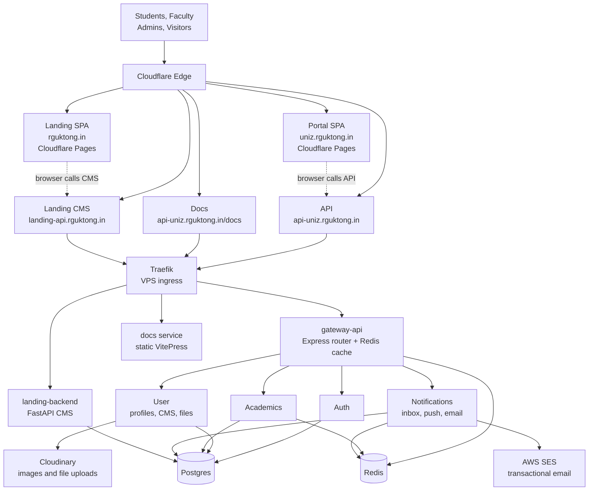
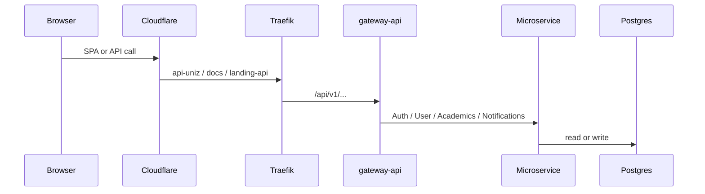
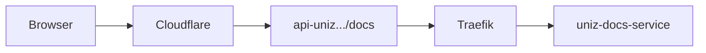

# UniZ | University Intelligence Engine

[](https://github.com/uniz-rguktong/uniz-master/actions/workflows/deploy.yml)


> Campus platform for RGUKT Ongole — Cloudflare Pages frontends, Traefik + gateway-api on a K3s VPS, Postgres + Redis, Cloudinary uploads, AWS SES email, and VitePress docs.

**Live docs:** [api-uniz.rguktong.in/docs](https://api-uniz.rguktong.in/docs) · **Handover (Notion):** same architecture + action flows as this README.

## Repo map

Canonical layout: **[STRUCTURE.md](STRUCTURE.md)**.

| Path | Role |
|------|------|
| `apps/` · `packages/` | Workspaces (stable — do not rename for CI/K3s) |
| `apps/uniz-docs/` | In-house VitePress docs (served at `/docs`) |
| `docker/local/` | Laptop Compose demo (`make up`) |
| `docker/prod/` | CI → GHCR → **K3s** images only |
| `scripts/{ci,deploy,local,ops}/` | Audience-grouped tooling |
| `docs/local/` | Contributor setup notes |
| `infra/` | Kubernetes manifests |

**Production is K3s on one VPS.** Portal and Landing SPAs deploy to Cloudflare Pages. Docs, APIs, Postgres, and Redis run on the VPS.

<details>
<summary><strong>Local setup — click to expand</strong></summary>

<br/>

You do **not** need production passwords or VPS access.

### A — Full stack in Docker (fastest demo)

```bash
git clone https://github.com/uniz-rguktong/uniz-master.git
cd uniz-master
cp .env.example .env
make up && make seed
```

| What | Where |
|------|--------|
| Portal | http://localhost:8080 (or `WEB_PORT`) |
| API (via portal) | http://localhost:8080/api/v1 |
| Sign-in | `webmaster` / `password123` |

Details: [docker/README.md](docker/README.md).

### B — Hot-reload development

```bash
cp secrets.env.example secrets.env
npm run setup:local
npm run seed:local    # first time
npm run dev:all
```

| What | Where |
|------|--------|
| Portal | http://localhost:5173 |
| API gateway | http://localhost:3000/api/v1 |
| Docs (optional) | `npm run docs:dev` → http://localhost:3333/docs/ |
| Sign-in (after seed) | `webmaster` / `password123` |

Full guide: [docs/local/LOCAL_SETUP.md](docs/local/LOCAL_SETUP.md) · [CONTRIBUTING.md](CONTRIBUTING.md).

### Manual / troubleshooting

```bash
# Postgres + Redis only
docker compose -f infra/core-infra/docker-compose.yml up -d uniz-redis uniz-postgres
npm install
npm run vault:sync
npm run prisma:generate
# then: npm run setup:local  OR  make up
```

### Seed

```bash
npm run seed:local
```

### Windows

Use WSL2 + Docker Desktop. Prefer bash for `setup-local.sh`.

`secrets.env.example` and `.env.example` ship **dev-only** placeholders. Never commit `secrets.env` or `.env`.

</details>

## Production (maintainers)

Push to `main` → GitHub Actions builds GHCR images → `kubectl` on K3s; Cloudflare Pages builds portal/landing.

- VPS deploy: [`.github/workflows/deploy.yml`](.github/workflows/deploy.yml)
- Frontends: [`.github/workflows/deploy-cloudflare-pages.yml`](.github/workflows/deploy-cloudflare-pages.yml)
- Migrations on VPS: `scripts/deploy/prisma-migrate-deploy-all.sh`
- In-house docs: [https://api-uniz.rguktong.in/docs](https://api-uniz.rguktong.in/docs) (`apps/uniz-docs`, Traefik → `uniz-docs-service`)

## Architecture

Cloudflare owns the public edge and static SPAs. The VPS owns APIs, **docs**, CMS backend, Postgres, and Redis. **Cloudinary** stores uploads; **AWS SES** sends mail.


```mermaid
flowchart TB
  Users["Students, Faculty<br/>Admins, Visitors"] --> CF["Cloudflare Edge"]

  CF --> Portal["Portal SPA<br/>uniz.rguktong.in<br/>Cloudflare Pages"]
  CF --> Landing["Landing SPA<br/>rguktong.in<br/>Cloudflare Pages"]
  CF --> API["API<br/>api-uniz.rguktong.in"]
  CF --> Docs["Docs<br/>api-uniz.rguktong.in/docs"]
  CF --> LandingAPI["Landing CMS<br/>landing-api.rguktong.in"]

  API --> Traefik["Traefik<br/>VPS ingress"]
  Docs --> Traefik
  LandingAPI --> Traefik

  Traefik --> GW["gateway-api<br/>Express router + Redis cache"]
  Traefik --> DocsSvc["docs service<br/>static VitePress"]
  Traefik --> LandingBE["landing-backend<br/>FastAPI CMS"]

  GW --> Auth["Auth"]
  GW --> User["User<br/>profiles, CMS, files"]
  GW --> Academics["Academics"]
  GW --> Notif["Notifications<br/>inbox, push, email"]

  Auth --> PG[("Postgres")]
  User --> PG
  Academics --> PG
  Notif --> PG
  LandingBE --> PG

  GW --> Redis[("Redis")]
  Academics --> Redis
  Notif --> Redis

  User --> Cloudinary["Cloudinary<br/>images and file uploads"]
  Notif --> SES["AWS SES<br/>transactional email"]

  Portal -.->|browser calls API| API
  Landing -.->|browser calls CMS| LandingAPI
```

| Piece | Role |
|-------|------|
| **Cloudflare Pages** | Portal + Landing SPAs (static HTML/JS/CSS) |
| **Traefik** | VPS ingress / TLS edge — chooses which pod gets the request |
| **gateway-api** | App router (not a load balancer): path → Auth / User / Academics / Notifications + Redis cache |
| **Auth / User / Academics / Notifications** | Always-on K3s services |
| **Docs** | Static VitePress at `api-uniz.rguktong.in/docs` (VPS, not Pages) |
| **Landing-backend** | FastAPI public CMS (Compose on host) |
| **Postgres** | Source of truth |
| **Redis** | Short-lived cache / queues |
| **Cloudinary** | Profile photos and file uploads (URLs stored in Postgres) |
| **AWS SES** | OTP, password reset, campus email via Notifications |

Parked at 0 replicas: portal/landing pods, nginx gateway hop, outpass, standalone mail/files/cron Deployments (work folded into user + notifications).

## Action flows

Canonical Mermaid maps for every major role action live in the docs site:

**[Action flows](https://api-uniz.rguktong.in/docs/system/action-flows)** · source: [`apps/uniz-docs/system/action-flows.md`](apps/uniz-docs/system/action-flows.md)

| Role | What they do |
|------|----------------|
| **Student** | Login, OTP reset, profile, grades, attendance, registration + PDF, notices, grievance, inbox |
| **Webmaster / COE / Director** | Students bulk, grades/attendance upload, semester builder, CMS, push, password resets |
| **Dean** | Allocations, semester advance, academics + CMS |
| **HOD** | Branch semester approval, registration tracking |
| **SWO** | List / resolve / delete grievances |
| **Faculty** | Profile, student search, password |
| **Security / Caretaker / Warden** | Gate / approve flows when outpass flag is on |

### Request path (one glance)


```mermaid
sequenceDiagram
  participant Browser
  participant CF as Cloudflare
  participant Traefik
  participant GW as gateway-api
  participant Svc as Microservice
  participant PG as Postgres

  Browser->>CF: SPA or API call
  CF->>Traefik: api-uniz / docs / landing-api
  Traefik->>GW: /api/v1/...
  GW->>Svc: Auth / User / Academics / Notifications
  Svc->>PG: read or write
```

### Docs path


```mermaid
flowchart LR
  Browser --> CF[Cloudflare]
  CF --> DocsURL[api-uniz.../docs]
  DocsURL --> Traefik
  Traefik --> DocsSvc[uniz-docs-service]
```

## Technology stack

| Layer | Technology | Purpose |
| :---- | :--------- | :------ |
| Frontends | React SPAs on Cloudflare Pages | Portal + public landing |
| Docs | VitePress on VPS | `api-uniz.rguktong.in/docs` |
| Edge | Cloudflare + Traefik | CDN, TLS, ingress |
| API | Node.js (TypeScript) + Express gateway | Microservices + routing |
| Data | PostgreSQL 17 + Prisma | Academic and campus records |
| Cache / MQ | Redis + BullMQ | Gateway cache and jobs |
| Uploads | Cloudinary | Images and files |
| Email | AWS SES (via Notifications) | Transactional mail |
| Containers | Docker + GHCR | Service images |
| Orchestration | K3s | Production VPS |
| CI/CD | GitHub Actions | Build, test, deploy |

## Cloudinary and AWS SES

Uploads and mail are **managed SaaS**, not VPS disks.

```bash
# secrets.env / production vault — use your own values
CLOUDINARY_CLOUD_NAME=your_cloud_name
CLOUDINARY_UPLOAD_PRESET=your_upload_preset
VITE_CLOUDINARY_CLOUD_NAME=your_cloud_name
VITE_CLOUDINARY_UPLOAD_PRESET=your_upload_preset
AWS_ACCESS_KEY_ID=...
AWS_SECRET_ACCESS_KEY=...
AWS_REGION=ap-south-1
SES_FROM_EMAIL=no-reply@example.com
```

Login and academics work without Cloudinary. Local/dev mail can fall back to Gmail when SES is unset. Never commit real keys.

## Environment & security

| Layer | Who | Secrets | In git? |
|-------|-----|---------|---------|
| Local hot-reload | Contributors | `secrets.env` from example | **No** |
| Local Compose | Contributors | `.env` from `.env.example` | **No** |
| Production | Maintainers | VPS `/root/uniz-secrets.env` + Actions secrets | **No** |
| Templates | Everyone | `secrets.env.example`, `.env.example` | **Yes** — placeholders |

**Maintainers** (VPS SSH):

```bash
npm run vault:vps:status
npm run vault:vps:list
npm run vault:vps:show -- KEY
```

Do **not** put production passwords, API keys, or SSH private keys in the README, issues, or PRs.
