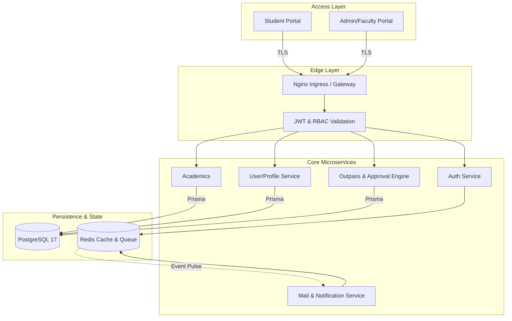

# UniZ | University Intelligence Engine

[](https://github.com/uniz-rguktong/uniz-master/actions/workflows/deploy.yml)


> **UNIZ SYSTEMS OPERATIONS 2026**
> _The digital backbone for enterprise-scale educational administration, built on a robust, self-healing microservices architecture._

## High-Performance Ecosystem Architecture

UniZ is a monorepo-managed microservices ecosystem designed for high availability, low latency, and enterprise-grade security. The system runs on a K3s cluster, ensuring automated scaling and resilience.


```mermaid
graph TD
    subgraph Users ["Access Layer"]
        Student["Student Portal"]
        Admin["Admin/Faculty Portal"]
    end

    subgraph Edge ["Edge Layer"]
        Nginx["Nginx Ingress / Gateway"]
        Auth_Edge["JWT & RBAC Validation"]
    end

    subgraph Services ["Core Microservices"]
        Academics["Academics"]
        Auth["Auth Service"]
        Profiles["User/Profile Service"]
        Outpass["Outpass & Approval Engine"]
        Mail["Mail & Notification Service"]
    end

    subgraph Data ["Persistence & State"]
        PG[(PostgreSQL 17)]
        Redis[(Redis Cache & Queue)]
    end

    Student & Admin -->|TLS| Nginx
    Nginx --> Auth_Edge
    Auth_Edge --> Academics & Auth & Profiles & Outpass
    Academics & Profiles & Outpass -->|Prisma| PG
    Auth & Mail --> Redis
    Redis -.->|Event Pulse| Mail
```

## Key Innovation: Edge-First Security & Self-Healing

1.  **Edge Gateway**: Centralized Nginx routing with edge-level CORS management and SSL termination, isolating internal services in a private Kubernetes network.
2.  **Horizontal Scalability**: Leveraging K3s HPA to dynamically provision resources during traffic spikes.
3.  **Atomic Data Integrity**: Prisma-backed PostgreSQL 17 cluster ensuring ACID compliance across academic workflows.
4.  **Asynchronous Efficiency**: Moving heavy tasks like distribution and auditing to Redis-backed background workers.

## Technology Stack

| Layer                | Technology           | Purpose                                              |
| :------------------- | :------------------- | :--------------------------------------------------- |
| **Logic**            | Node.js (TypeScript) | Scalable, type-safe microservice implementation.     |
| **Data Engine**      | PostgreSQL 17        | Relational storage for critical academic records.    |
| **ORM**              | Prisma               | Type-safe database access and automated migrations.  |
| **Caching/MQ**       | Redis                | Session persistence and asynchronous job queuing.    |
| **Containerization** | Docker               | Isolated, reproducible service environments.         |
| **Orchestration**    | K3s (Kubernetes)     | Production cluster management and auto-scaling.      |
| **CI/CD**            | GitHub Actions       | Automated build, test, and VPS deployment pipelines. |

## For RGUKT contributors

Anyone with a clone can run UniZ **locally**. You do **not** need production passwords, VPS access, or AWS keys to develop and open pull requests.

```bash
git clone https://github.com/uniz-rguktong/uniz-master.git
cd uniz-master

# 1. Create your local env from safe placeholders (never commit secrets.env)
cp secrets.env.example secrets.env

# 2. Start Postgres + Redis, install deps, sync env, run Prisma
npm run setup:local

# 3. Optional but recommended first time — sample users & academics data
npm run seed:local

# 4. Run the stack
npm run dev:all
```

| What | Where |
|------|--------|
| Portal | http://localhost:5173 |
| API gateway | http://localhost:3000/api/v1 |
| Local sign-in (after seed) | `webmaster` / `password123` |

`secrets.env.example` ships with **dev-only** values (local DB, test Turnstile keys, dummy JWT, Cloudinary placeholders). Use **your own** Cloudinary keys for upload testing — **never** paste production credentials into the repo or commit `secrets.env`.

### Docker Compose (full stack on laptop)

Same product as production, without K3s. **Does not replace VPS** (VPS stays GitHub Actions → GHCR → kubectl).

```bash
cp .env.example .env
make up && make seed
# Portal: http://localhost:8080 (or WEB_PORT) — webmaster / password123
```

Details: [docker/README.md](docker/README.md). Layout: [STRUCTURE.md](STRUCTURE.md).


### Cloudinary (optional — uploads only)

The repo **does not** ship real Cloudinary credentials. For local upload testing, create a free account at [cloudinary.com](https://cloudinary.com/) and put **your own** cloud name + unsigned upload preset into `secrets.env`:

```bash
CLOUDINARY_CLOUD_NAME=your_cloud_name
CLOUDINARY_UPLOAD_PRESET=your_upload_preset
VITE_CLOUDINARY_CLOUD_NAME=your_cloud_name
VITE_CLOUDINARY_UPLOAD_PRESET=your_upload_preset
```

Core login, academics, and outpass work fine without Cloudinary. Never commit real keys.

**More detail:** [docs/local/LOCAL_SETUP.md](./docs/local/LOCAL_SETUP.md) · [CONTRIBUTING.md](./CONTRIBUTING.md)

## Local Development (quick)

Works on **macOS**, **Linux**, **Windows (WSL2)**, and headless Linux environments.

```bash
git clone https://github.com/uniz-rguktong/uniz-master.git && cd uniz-master
cp secrets.env.example secrets.env
npm run setup:local
npm run seed:local   # first time
npm run dev:all
```

## Contributing

We welcome contributions from the RGUKT community. See [CONTRIBUTING.md](./CONTRIBUTING.md) for PR workflow, builds, and conventions.

## Environment & security

UniZ separates **contributor local dev** from **production** so cloning the repo never exposes live secrets.

| Layer | Who | Secrets | In git? |
|-------|-----|---------|---------|
| **Local dev** | Any contributor | `secrets.env` (from `secrets.env.example`) | **No** — gitignored |
| **Production** | Maintainers only | VPS `/root/uniz-secrets.env` + GitHub Actions secrets | **No** |
| **Example template** | Everyone | `secrets.env.example` | **Yes** — placeholders only |

**Contributors:** use `cp secrets.env.example secrets.env` and `npm run setup:local`. Production DB URLs, AWS keys, and VPS SSH keys are not shared via the repo.

**Maintainers** (deploy team with VPS SSH access):

```bash
# In your local secrets.env (gitignored), set:
# UNIZ_VPS_HOST, UNIZ_VPS_USER, UNIZ_VPS_SSH_KEY

npm run vault:vps:status          # vault metadata, no values
npm run vault:vps:list            # key names only
npm run vault:vps:show -- KEY     # masked value
npm run vault:vps -- reveal KEY   # full value — prompts + VPS audit log
```

Production deploys run through GitHub Actions; credentials are injected over SSH at deploy time — not stored in source control.

**Do not** put real production passwords, API keys, or SSH private keys in the README, issues, or pull requests.
