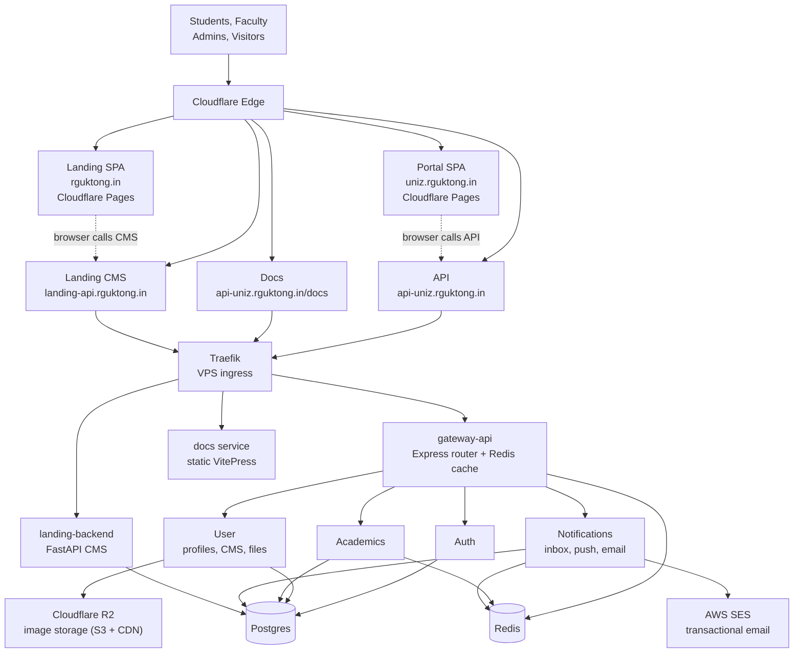
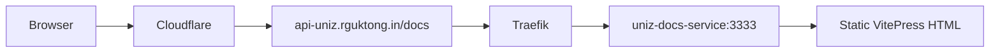

# UniZ | University Intelligence Engine

[](https://github.com/uniz-rguktong/uniz-master/actions/workflows/deploy.yml)

**New here?** [Handover guide](docs/HANDOVER.md) · **Live docs:** [api-uniz.rguktong.in/docs](https://api-uniz.rguktong.in/docs) · **Action flows:** [docs/system/action-flows](https://api-uniz.rguktong.in/docs/system/action-flows) · **Handover:** [Notion](https://app.notion.com/p/3a01ace6b28c819dbd07cf907944c082)

## Architecture


```mermaid
flowchart TB
  Users["Students, Faculty<br/>Admins, Visitors"] --> CF["Cloudflare Edge"]

  CF --> Portal["Portal SPA<br/>uniz.rguktong.in<br/>Cloudflare Pages"]
  CF --> Landing["Landing SPA<br/>rguktong.in<br/>Cloudflare Pages"]
  CF --> API["API<br/>api-uniz.rguktong.in"]
  CF --> Docs["Docs<br/>api-uniz.rguktong.in/docs"]
  CF --> LandingAPI["Landing CMS<br/>landing-api.rguktong.in"]

  API --> Traefik["Traefik<br/>VPS ingress"]
  Docs --> Traefik
  LandingAPI --> Traefik

  Traefik --> GW["gateway-api<br/>Express router + Redis cache"]
  Traefik --> DocsSvc["docs service<br/>static VitePress"]
  Traefik --> LandingBE["landing-backend<br/>FastAPI CMS"]

  GW --> Auth["Auth"]
  GW --> User["User<br/>profiles, CMS, files"]
  GW --> Academics["Academics"]
  GW --> Notif["Notifications<br/>inbox, push, email"]

  Auth --> PG[("Postgres")]
  User --> PG
  Academics --> PG
  Notif --> PG
  LandingBE --> PG

  GW --> Redis[("Redis")]
  Academics --> Redis
  Notif --> Redis

  User --> R2["Cloudflare R2<br/>image storage (S3 + CDN)"]
  Notif --> SES["AWS SES<br/>transactional email"]

  Portal -.->|browser calls API| API
  Landing -.->|browser calls CMS| LandingAPI
```

### What you are looking at

UniZ is split into two layers. Cloudflare owns the public edge and the static frontends. The VPS owns APIs, **docs**, CMS, and the databases. Off-box services handle media and email: **Cloudflare R2** for image storage, **AWS SES** for mail.

### What is a SPA?

**SPA** = Single Page Application. The browser downloads one HTML shell and JS once; navigation happens client-side. Portal and Landing are React SPAs on Cloudflare Pages. Live data comes from API hosts below.

### Cloudflare

Cloudflare terminates HTTPS, filters junk, and serves Portal (`uniz.rguktong.in`) and Landing (`rguktong.in`) from the edge. SPA data calls still go through Cloudflare DNS to the VPS.

### Traefik

Ingress on the VPS K3s cluster. First process on the machine for `api-uniz.rguktong.in`, `/docs`, and `landing-api.rguktong.in`. Chooses which in-cluster service gets the request.

### gateway-api

Application router (not a load balancer). Path → Auth / User / Academics / Notifications. Also Redis GET cache, health aggregation, and feature gates (outpass parked).

### Docs API (VitePress)

In-house docs are a **static VitePress site** on the VPS — not Cloudflare Pages.


```mermaid
flowchart LR
  Browser --> CF["Cloudflare"]
  CF --> DocsURL["api-uniz.rguktong.in/docs"]
  DocsURL --> Traefik
  Traefik --> DocsSvc["uniz-docs-service:3333"]
  DocsSvc --> VP["Static VitePress HTML"]
```

- App: `apps/uniz-docs`
- Public: [https://api-uniz.rguktong.in/docs](https://api-uniz.rguktong.in/docs)
- Includes architecture, API reference, role guides, and [action flows](https://api-uniz.rguktong.in/docs/system/action-flows)

### Backend services

Auth issues JWT. User holds profiles, campus CMS notices, grievances, and file uploads. Academics is results and registration. Notifications owns inbox, web push, and email (mail folded in). Landing-backend is FastAPI for the public website CMS. Docs is VitePress under `/docs`.

### Cloudflare R2 and AWS SES

**Cloudflare R2** (S3-compatible object storage, served over the Cloudflare CDN) stores profile photos, banners, and website images. Uploads go to the user-service `/files/image/upload` endpoint, which compresses to WebP with `sharp` and writes to R2; User stores the resulting public URL in Postgres. **AWS SES** sends OTP / reset / campus mail via Notifications (local can fall back to Gmail). (Excel/CSV bulk backups still use Cloudinary.)

### Postgres and Redis

Postgres is source of truth. Redis is short-lived: gateway cache, upload progress, BullMQ (OTP mail, push broadcasts, registration PDFs).

### Request path in one sentence

User loads Portal from Cloudflare Pages → SPA calls `api-uniz.rguktong.in` → Cloudflare → Traefik → gateway-api → owning service → Postgres (optionally Redis / Cloudflare R2 / SES).

### What we deliberately do not run always-on

Portal/Landing pods, nginx gateway hop, outpass (gated), standalone mail/files/cron Deployments — folded or parked so one 4 vCPU VPS stays usable.

### Role cheat sheet

| Role | Shell | Main actions |
|------|-------|----------------|
| Student | `/student` | Login, profile, grades, attendance, registration, PDF, notices, grievance, inbox |
| Webadmin / COE / Director | Admin dashboards | Students, uploads, semester, CMS, push, resets |
| Dean | DeanDashboard | Allocations, advance, academics, CMS |
| HOD | DeanDashboard slim | Branch approval, registration tracking |
| SWO | SWODashboard | Grievance list / resolve / delete |
| Faculty | `/faculty` | Profile, student search, password |

Canonical layout: **[STRUCTURE.md](STRUCTURE.md)**.

### Contributing & review flow

Collaborators work on branches and open PRs to `main`. Every PR needs an approving review from a **code owner** and only a maintainer with push access can merge — see **[CONTRIBUTING.md](CONTRIBUTING.md)** and the full policy in **[docs/ops/github-governance.md](docs/ops/github-governance.md)**.

---

<details>
<summary><h2>okay, but how to setup this locally ? </h2></summary>

<br/>

You do **not** need production passwords or VPS access.

### A — Full stack in Docker (fastest demo)

```bash
git clone https://github.com/uniz-rguktong/uniz-master.git
cd uniz-master
cp .env.example .env
make up && make seed
```

| What | Where |
|------|--------|
| Portal | http://localhost:8080 (or `WEB_PORT`) |
| API (via portal) | http://localhost:8080/api/v1 |
| Sign-in | `webadmin` / `password123` |

Details: [docker/README.md](docker/README.md).

### B — Hot-reload development

```bash
cp secrets.env.example secrets.env
npm run setup:local
npm run seed:local    # first time
npm run dev:all
```

| What | Where |
|------|--------|
| Portal | http://localhost:5173 |
| API gateway | http://localhost:3000/api/v1 |
| Docs (optional) | `npm run docs:dev` → http://localhost:3333/docs/ |
| Sign-in (after seed) | `webadmin` / `password123` |

Full guide: [docs/local/LOCAL_SETUP.md](docs/local/LOCAL_SETUP.md) · [CONTRIBUTING.md](CONTRIBUTING.md).

### Manual / troubleshooting

```bash
# Postgres + Redis only
docker compose -f docker/local/compose.db.yml up -d uniz-redis uniz-postgres
npm install
npm run vault:sync
npm run prisma:generate
# then: npm run setup:local  OR  make up
```

### Seed

```bash
npm run seed:local
```

### Windows

Use WSL2 + Docker Desktop. Prefer bash for `setup-local.sh`.

`secrets.env.example` and `.env.example` ship **dev-only** placeholders. Never commit `secrets.env` or `.env`.

</details>
