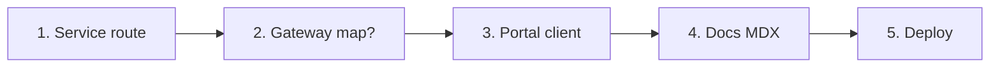

## Steps

### 1. Implement in the owning service

Example: new student endpoint → `apps/uniz-user/src/routes/profile.routes.ts` (+ controller). Keep auth middleware consistent with sibling routes.

### 2. Gateway

If the path stays under an existing prefix (`/api/v1/profile/...`), **no gateway change**.

New top-level prefix (e.g. `/api/v1/billing`):

1. Add to `serviceMap` in `apps/uniz-gateway/src/index.ts`
2. Set ConfigMap `BILLING_SERVICE_URL` (or reuse an existing service URL)
3. Redeploy gateway-api

### 3. Portal

Add function in `apps/uniz-portal/src/api/` using `resolveApiBaseUrl()`. Rebuild Pages so `VITE_*` stays correct.

### 4. Document

Add MDX under `apps/uniz-docs/api/...` and register in `docs.json`. Link from [Search index](/search-index).

### 5. Deploy

Push to `main` → VPS workflow rebuilds changed images. Frontend-only → Pages workflow.

## Checklist

- [ ] AuthZ: role checks on service
- [ ] Validation / error shape matches existing APIs
- [ ] Health unaffected (no blocking work on `/health`)
- [ ] Smoke curl example in docs
