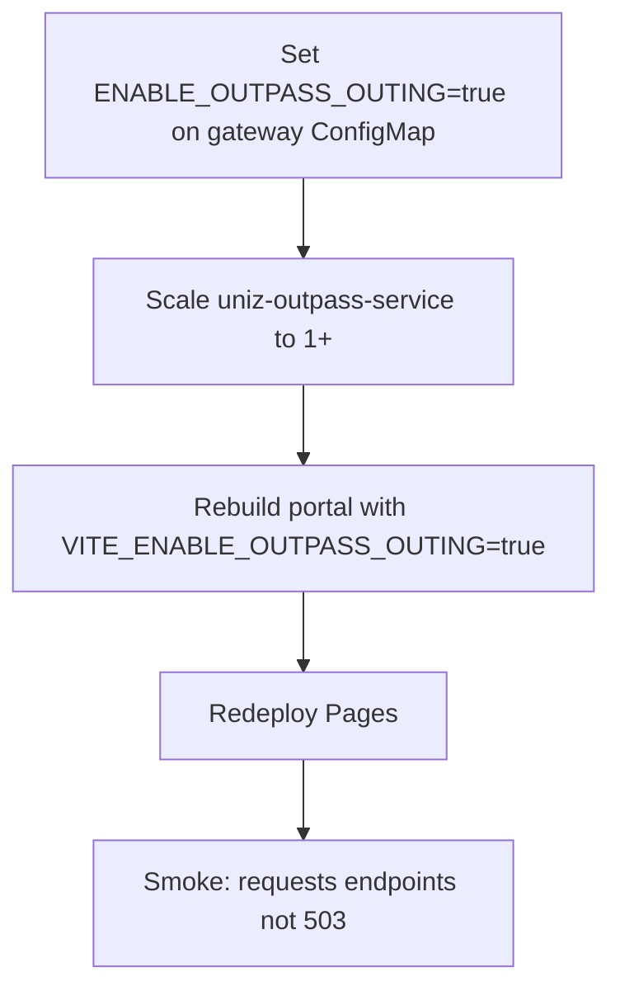

Outpass/outing is **disabled in production** by design. Grievance remains on **user-service**.

## Enable checklist

1. **Gateway flag** — ConfigMap `uniz-config`: `ENABLE_OUTPASS_OUTING=true`, restart `uniz-gateway-api`
2. **Scale** — `kubectl scale deploy/uniz-outpass-service --replicas=1` (re-add HPA only if you intend always-on)
3. **Portal flag** — GitHub secret / Pages env `VITE_ENABLE_OUTPASS_OUTING=true`, redeploy Pages
4. **Migrate** — confirm DB schema for outpass service is current
5. **Smoke** — `post-deploy-smoke.sh` expectations must be updated (today expects **503**)

## Disable again

Reverse flags, scale outpass to 0, delete outpass HPA if present, rebuild portal with flag false.
