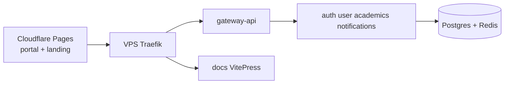

# UniZ Documentation

Use search (**Ctrl/Cmd + K**) or the [Search index](/search-index) to find **how something is implemented** and **what to change**.

- **[System architecture](/system/overview)** — Mermaid maps of Pages, Traefik, gateway-api, and data stores
- **[Action flows](/system/action-flows)** — Student, webmaster, HOD, dean, SWO grievance, auth — every major action
- **[Search index](/search-index)** — Keyword table for every major topic
- **[Deploy & ops](/ops/deploy)** — VPS GHCR deploy, Cloudflare Pages, runbooks
- **[API gateway map](/api/platform/gateway)** — Every `/api/v1` prefix → upstream service
- **[Docs service](/services/docs)** — VitePress at `api-uniz.rguktong.in/docs`
- **[Student guide](/students/login)** — Login, academics, profile
- **[How to add an API](/howto/add-api-route)** — Service → gateway → portal → docs checklist

## Production shape (one glance)

::: info
Outpass/outing UI and `/api/v1/requests/*` (except grievance) are **disabled** in production. See [Feature flags](/ops/feature-flags).
:::
