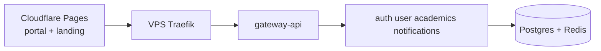

Welcome to UniZ documentation. Use search (**Ctrl/Cmd + K**) or the [Search index](/search-index) to find **how something is implemented** and **what to change**.

<CardGroup cols={2}>
  <Card title="System architecture" icon="sitemap" href="/system/overview">
    Mermaid maps of Pages, Traefik, gateway-api, and data stores.
  </Card>
  <Card title="Search index" icon="magnifying-glass" href="/search-index">
    Keyword table for every major topic.
  </Card>
  <Card title="Deploy & ops" icon="rocket" href="/ops/deploy">
    VPS GHCR deploy, Cloudflare Pages, runbooks.
  </Card>
  <Card title="API gateway map" icon="code" href="/api/platform/gateway">
    Every /api/v1 prefix → upstream service.
  </Card>
  <Card title="Student guide" icon="graduation-cap" href="/students/login">
    Login, academics, profile.
  </Card>
  <Card title="How to add an API" icon="plus" href="/howto/add-api-route">
    Service → gateway → portal → docs checklist.
  </Card>
</CardGroup>

## Production shape (one glance)

<Note>
  Outpass/outing UI and `/api/v1/requests/*` (except grievance) are **disabled** in production. See [Feature flags](/ops/feature-flags).
</Note>
