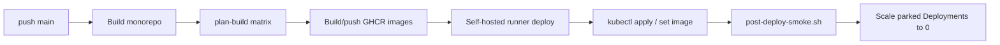

## Pipeline



| Workflow | File |
|----------|------|
| PR checks | `.github/workflows/ci.yml` |
| Production VPS | `.github/workflows/deploy.yml` |
| Frontends | `.github/workflows/deploy-cloudflare-pages.yml` |

## Key scripts

| Script | Role |
|--------|------|
| `scripts/ci/ci-plan-build-matrix.sh` | Decide which images to rebuild |
| `scripts/ci/ci-build-*.sh` | Docker build → GHCR |
| `scripts/ci/ci-remote-deploy.sh` | On-VPS pull + rollout + park replicas |
| `scripts/deploy/deploy.sh` | Core deploy orchestration |
| `scripts/ops/post-deploy-smoke.sh` | HTTP smoke (portal, API, outpass 503) |

## What gets deployed

Changed services rebuild as GHCR images `ghcr.io/uniz-rguktong/...`. Kustomize under `infra/core-infra/kubernetes/base/` is applied; image tags updated on Deployments.

## Manual / emergency

```bash
# On VPS (with kubeconfig)
kubectl get deploy,hpa
kubectl rollout status deploy/uniz-gateway-api
bash scripts/ops/post-deploy-smoke.sh
```

## After every successful deploy

`ci-remote-deploy.sh` forces replicas **0** for mail, files, cron Deploy, outpass, portal, landing, and nginx gateway — so old manifests cannot leave them running.
