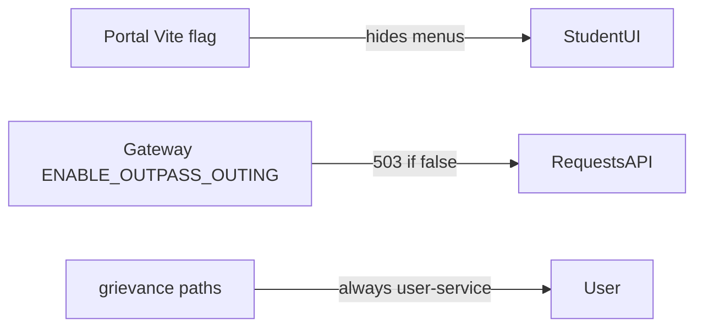

| Flag | Layer | Default | Effect |
|------|-------|---------|--------|
| `VITE_ENABLE_OUTPASS_OUTING` | Portal **build** | `false` | Hide outpass/outing UI |
| `ENABLE_OUTPASS_OUTING` | Gateway **runtime** ConfigMap | `false` | Allow `/api/v1/requests/*` except grievance |
| `VITE_MAINTENANCE_MODE` | Portal **build** | `false` | Show maintenance interstitial |

## How to enable outpass (full)

See [Revive outpass](/howto/revive-outpass) — both flags + scale Deployment + rebuild portal.

## Where configured

- GitHub secrets / Pages workflow env
- VPS ConfigMap `uniz-config` (`ENABLE_OUTPASS_OUTING`)
- Example: `secrets.env.example`
