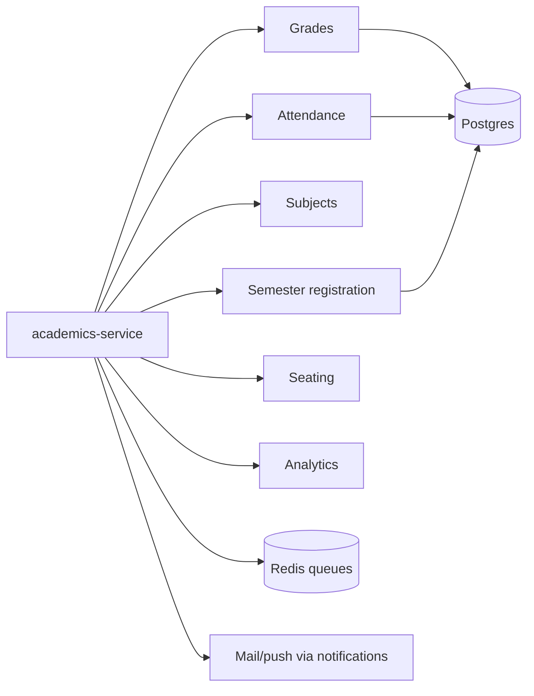

## Role

Academic records and registration lifecycle — the heaviest read/write path on results and registration days.

| | |
|--|--|
| **Code** | `apps/uniz-academics/` |
| **Entry** | `src/index.ts` |
| **Gateway** | `/api/v1/academics/*` |
| **HPA** | 1–3 |

## Domains

## Major route groups

| Group | Examples |
|-------|----------|
| Grades | `/grades`, batch upload, templates, publish progress |
| Attendance | `/attendance`, upload, templates, download |
| Subjects / semesters | `/subjects`, `/semester*`, elective groups, dean approve |
| Student registration | register subjects, PDFs, tracking |
| Faculty | faculty CRUD helpers |
| Analytics | `/analytics/admin-summary` |
| Queue | `/api/queue` workers |

API pages: [Grades](/api/academics/grades), [Attendance](/api/academics/attendance), [Subjects](/api/academics/subjects), [Registration](/api/academics/registration).

## Performance notes

- Composite indexes exist for grade/attendance hot paths
- Prefer query efficiency over blindly raising HPA past DB capacity
- Excel/PDF work should stay on queues — do not inline huge work on request threads
