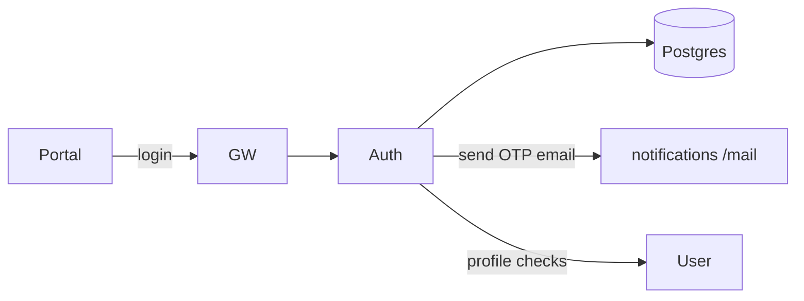

## Role

Issues JWTs and owns credential/OTP flows.

| | |
|--|--|
| **Code** | `apps/uniz-auth/` |
| **Entry** | `src/index.ts` |
| **K8s** | `uniz-auth-service` HPA 1–2 |
| **Gateway** | `/api/v1/auth/*` |

## Main routes

| Method | Path (service-local) | Purpose |
|--------|----------------------|---------|
| POST | `/login`, `/login/student`, `/login/admin` | Authenticate |
| POST | `/signup` | Registration (if enabled) |
| POST | `/otp/request`, `/otp/request-email`, `/otp/verify` | OTP |
| POST | `/password/reset`, `/password/change` | Password |
| POST | `/admin/reset-password`, `/admin/global-reset-password`, `/admin/suspend` | Admin ops |
| POST | `/logout` | Logout |
| GET | `/health` | Probe |
| * | `/internal/*` | Service-to-service (INTERNAL_SECRET) |

Public docs: [Login](/api/auth/login), [OTP](/api/auth/otp), [Password](/api/auth/password).

## Dependencies

## Env (important)

`DATABASE_URL`, `JWT_SECURITY_KEY`, `INTERNAL_SECRET`, `REDIS_URL`, `USER_SERVICE_URL`, `MAIL_SERVICE_URL` / `NOTIFICATION_SERVICE_URL`, `TURNSTILE_SECRET_KEY`, `GATEWAY_URL`.

## Change checklist

1. Add route in auth router/controller under `apps/uniz-auth/src/`
2. Ensure gateway already prefixes `/auth` (no gateway change if path stays under `/api/v1/auth`)
3. Update API MDX under `apps/uniz-docs/api/auth/`
4. Deploy via `deploy.yml` (auth image rebuild)
