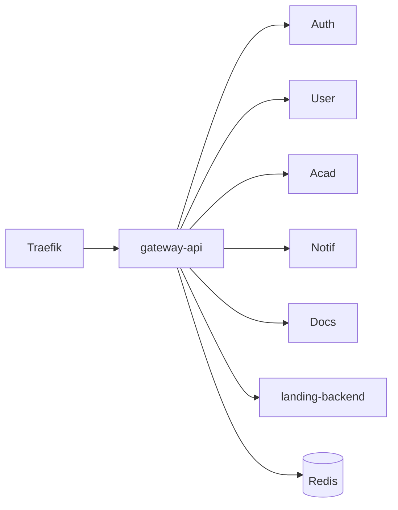

## Role

Single public API process for UniZ. Traefik sends `api-uniz.rguktong.in` traffic here (`:3000`). The old nginx Deployment `uniz-gateway` is **parked at 0 replicas**.

| | |
|--|--|
| **Code** | `apps/uniz-gateway/` |
| **Entry** | `src/index.ts` |
| **K8s** | `uniz-gateway-api` + HPA 1–2 |
| **Port** | 3000 |

## Responsibilities

1. **Route** `/api/v1/:service/*` → microservice via `serviceMap`
2. **Cache** eligible authenticated GETs in Redis
3. **Aggregate health** `GET /api/v1/system/health` (Redis TTL)
4. **Proxy docs** `/docs` → Mintlify pod
5. **Gate outpass** return 503 when `ENABLE_OUTPASS_OUTING` ≠ `true` (grievance excluded)
6. **CORS** from `CLIENT_URL`
7. **Analytics / CMS API** bridge to landing-backend

## Key env

| Variable | Purpose |
|----------|---------|
| `REDIS_URL` | Cache + health |
| `CLIENT_URL` | CORS allowlist |
| `ENABLE_OUTPASS_OUTING` | Unlock `/requests` (non-grievance) |
| `*_SERVICE_URL` | Override upstreams |
| `LANDING_API_URL` | Analytics / cms/api |
| `DOCS_SERVICE_URL` | Docs upstream |

## How to change routing

Edit `serviceMap` and the `/api/v1/:service/*path` handler in `apps/uniz-gateway/src/index.ts`, then rebuild/push image via VPS deploy workflow. Details: [Add API route](/howto/add-api-route).

## Related

- [Request flow](/system/request-flow)
- [API gateway map](/api/platform/gateway)
- [Health](/api/platform/health)
