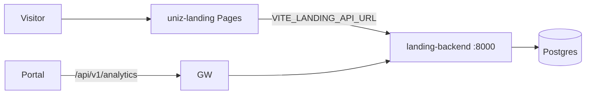

## Two pieces

| Piece | Runs on | Host |
|-------|---------|------|
| SPA | Cloudflare Pages | `rguktong.in` |
| FastAPI CMS | VPS Docker Compose | `landing-api.rguktong.in` |

## SPA

- Code: `apps/uniz-landing/`
- Routes: home, institute/academics pages, departments, notifications
- Deploy: [Cloudflare Pages](/ops/cloudflare-pages)

## FastAPI

- Code: `apps/uniz-landing-backend/`
- Entry: `main.py`
- Prefixes: `/api/home`, `/api/institute`, `/api/academics`, `/api/departments`, `/api/notifications`, `/api/analytics/*`, `/health`
- Compose (VPS): `docker-compose.yml.vps`
- Env refresh: `scripts/deploy/refresh-landing-backend-env.sh`
- K8s: Service + Endpoints → host IP `:8000` (`landing-backend.yaml`)

## Gateway bridges

- `/api/v1/analytics/*` → landing `/api/analytics/*`
- `/api/v1/cms/api/*` → landing-backend
