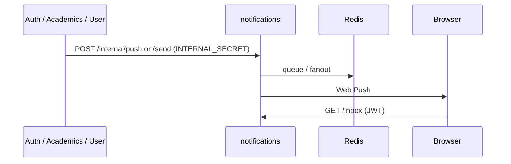

## Role

Campus communications: browser push subscriptions, in-app inbox, and SMTP/SES email (`MAIL_SERVICE_URL` points here).

| | |
|--|--|
| **Code** | `apps/uniz-notifications/` |
| **Entry** | `src/index.ts` |
| **Mail code** | `src/mail/*` (folded from uniz-mail) |
| **Gateway** | `/api/v1/notifications/*`, `/api/v1/mail/*` |
| **Replicas** | 1 (fixed) |

## Flows

## Routes

| Method | Path | Auth |
|--------|------|------|
| POST | `/subscribe` | JWT |
| GET | `/inbox` | JWT |
| POST | `/internal/push`, `/push/send` | Internal |
| GET | `/push/subscribers` | Admin/internal |
| POST | `/send` | Internal (mail) |
| GET | `/health` | Public probe |

## Env

`VAPID_PUBLIC_KEY`, `VAPID_PRIVATE_KEY`, `EMAIL_USER` / pool, `AWS_*` (SES optional), `FORCE_GMAIL`, `DATABASE_URL` / `NOTIFICATION_DATABASE_URL`, `REDIS_URL`, `INTERNAL_SECRET`, `JWT_SECURITY_KEY`.

Do **not** fold this into user-service casually — mail/push failure modes should stay isolated from profile reads.
