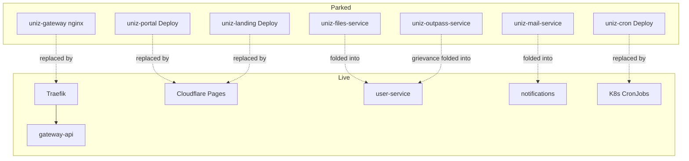

These Deployments stay in git for rollback but run at **replicas: 0** in production.

| Unit | Status | Logic now |
|------|--------|-----------|
| nginx `uniz-gateway` | Parked | Traefik → gateway-api |
| portal / landing Deploy | Parked | Cloudflare Pages |
| outpass | Parked + flag off | Revive via [Revive outpass](/howto/revive-outpass); grievance on user |
| mail | Parked | `apps/uniz-notifications/src/mail` |
| files | Parked | `apps/uniz-user` `files.routes` |
| cron Deployment | Parked | `cron-job.yaml` / storage cleanup CronJob |

CI enforces zeros in `scripts/ci/ci-remote-deploy.sh`.
