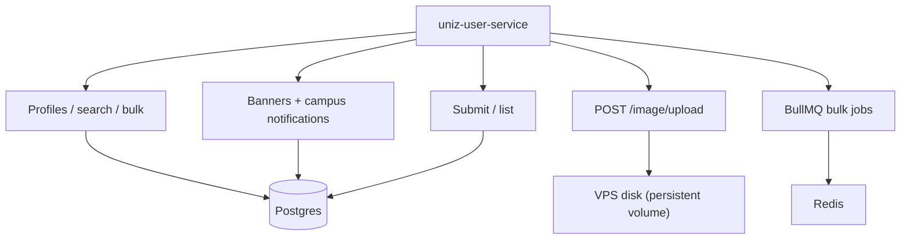

## Role

Identity/profile surface for the portal plus campus CMS and grievance. Files upload and grievance live here so outpass can stay scaled to 0.

| | |
|--|--|
| **Code** | `apps/uniz-user/` |
| **Entry** | `src/index.ts` |
| **Modules** | `profile.routes`, `cms.routes`, `files.routes`, `grievance.routes`, `queue.routes` |
| **Gateway** | `/api/v1/profile`, `/cms`, `/files`, `/grievance`, and grievance under `/requests` |

## Module map

## Notable routes

| Area | Examples |
|------|----------|
| Student | `/student/me`, `/student/bootstrap` |
| Faculty / admin | `/faculty/me`, `/admin/me`, student search, promote, status |
| CMS | `/banners/public`, `/notifications`, admin banner CRUD |
| Files | `POST /image/upload` (was files-service) |
| Grievance | `/submit`, `/list` (+ gateway aliases) |

## Env

`DATABASE_URL`, `REDIS_URL`, `JWT_SECURITY_KEY`, `INTERNAL_SECRET`, `AUTH_SERVICE_URL`, `ACADEMICS_SERVICE_URL`, `NOTIFICATION_SERVICE_URL`, `CMS_PUBLIC_API_KEY`, `UPLOADS_DIR` (self-hosted image path), `CLOUDINARY_*` (legacy Excel/CSV backups).

## Migration note

Grievance data moved from outpass → user. Ops script: `scripts/ops/migrate-grievances-to-user.sh`.
