# Action flows

Every diagram below follows the same shape:

**Browser (Portal)** → **Cloudflare** → **Traefik** → **gateway-api** → **owning service** → **Postgres / Redis / Cloudinary / SES**

Gateway path map: [Request flow](/system/request-flow) · [API gateway](/api/platform/gateway).

::: tip
Outpass and outing are **feature-flagged off** in production. Grievance still works via User service.
:::

## Auth (all roles)

### Student login

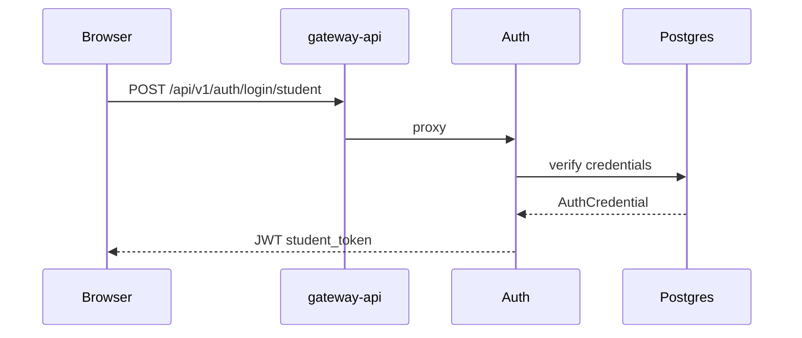

### Admin / faculty login

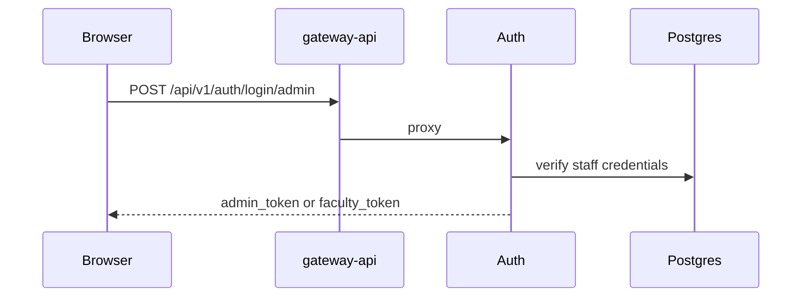

### Password reset via OTP

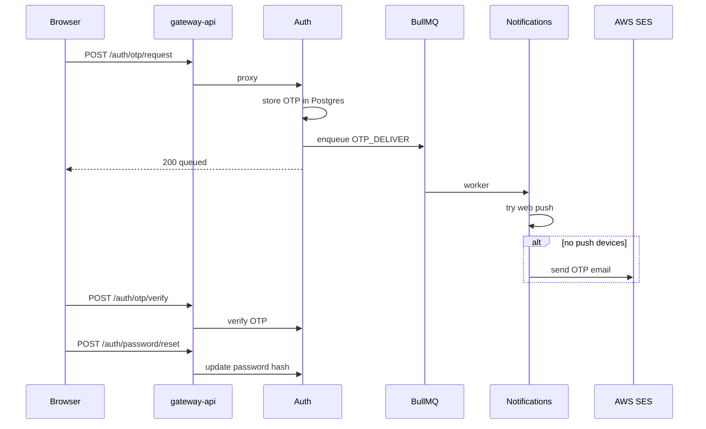

### Logged-in password change

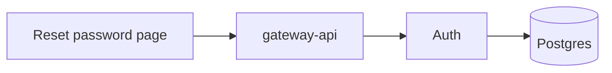

---

## Student

| Action | Endpoint | Service |
|--------|----------|---------|
| Bootstrap / home | `GET /profile/student/bootstrap` | User |
| Update profile | `PUT /profile/student/update` | User |
| Upload photo | `POST /files/image/upload` | User → Cloudinary |
| Grades | `GET /academics/grades` | Academics |
| Attendance | `GET /academics/attendance` | Academics |
| Register subjects | `POST /academics/student/register` | Academics |
| Registration PDF | `GET /academics/student/registration/pdf` | Academics → BullMQ |
| Notices | `GET /cms/notifications` | User |
| Submit grievance | `POST /grievance/submit` | User |
| Inbox | `GET /notifications/inbox` | Notifications |

### Profile bootstrap

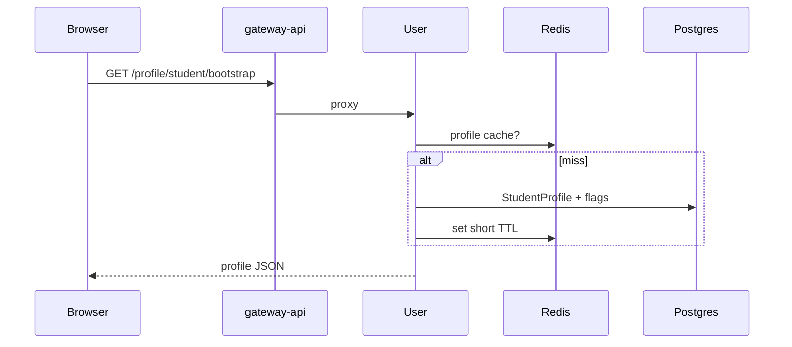

### Grades and attendance

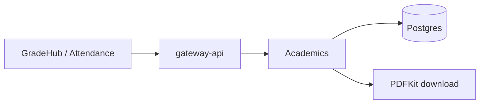

### Course registration

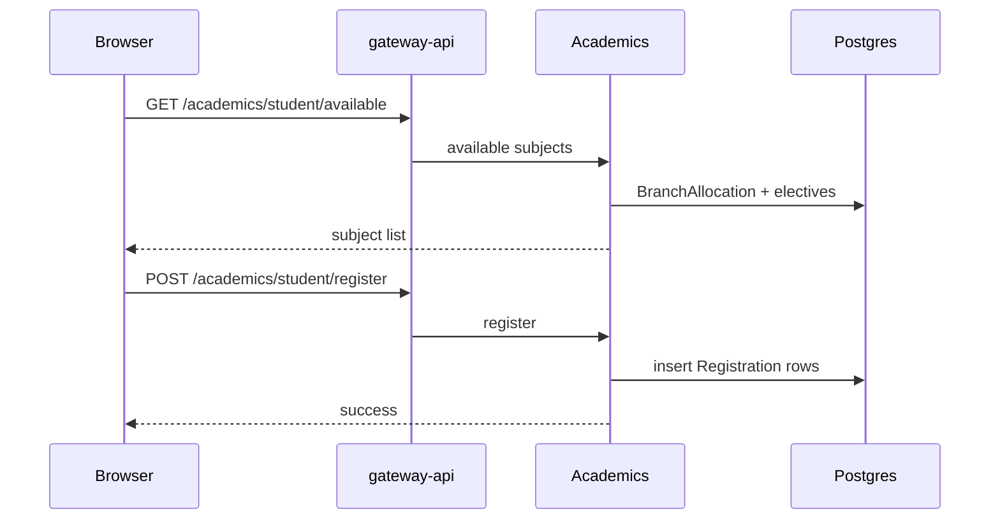

### Registration PDF (queued)

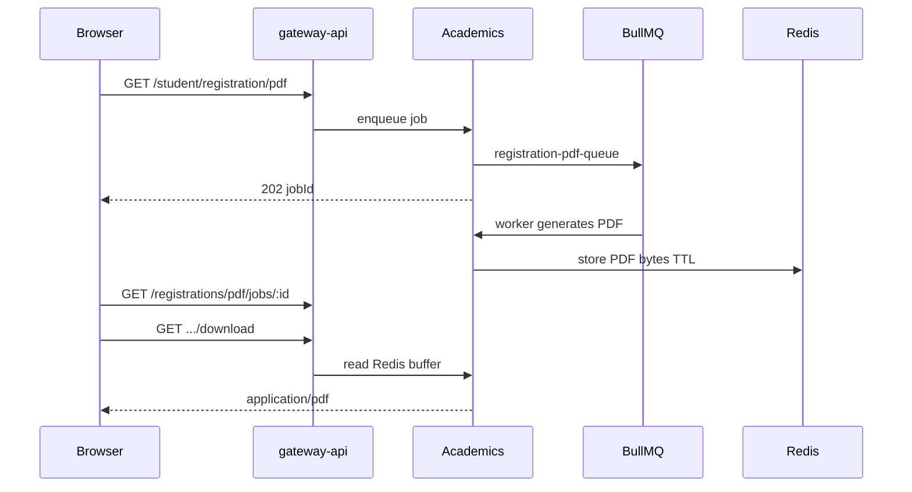

### Notices on home

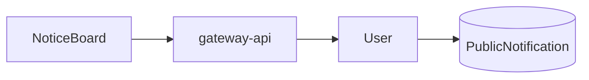

---

## Webmaster / COE / Director

Shared admin shell. COE uses Webmaster dashboard; Director is nearly identical (no semester-approvals tab).

| Action | Endpoint | Service |
|--------|----------|---------|
| Search / edit students | `/profile/student/search`, admin student CRUD | User |
| Bulk upload students | `/profile/admin/student/upload` | User → Redis job |
| Upload grades / attendance | `/academics/grades|attendance/upload` | Academics |
| Subjects CRUD | `/academics/subjects…` | Academics |
| Semester builder | `/academics/semester…` | Academics |
| Registration tracking + bulk PDF | `/registrations/tracking`, `/pdf/bulk` | Academics |
| Campus banners / updates | `/cms/admin/…` | User |
| Website CMS | `/cms/api/…` | Landing FastAPI |
| Push broadcast | `/notifications/push/send` | Notifications → BullMQ |
| Reset student password | `/auth/admin/global-reset-password` | Auth |

### Student bulk upload

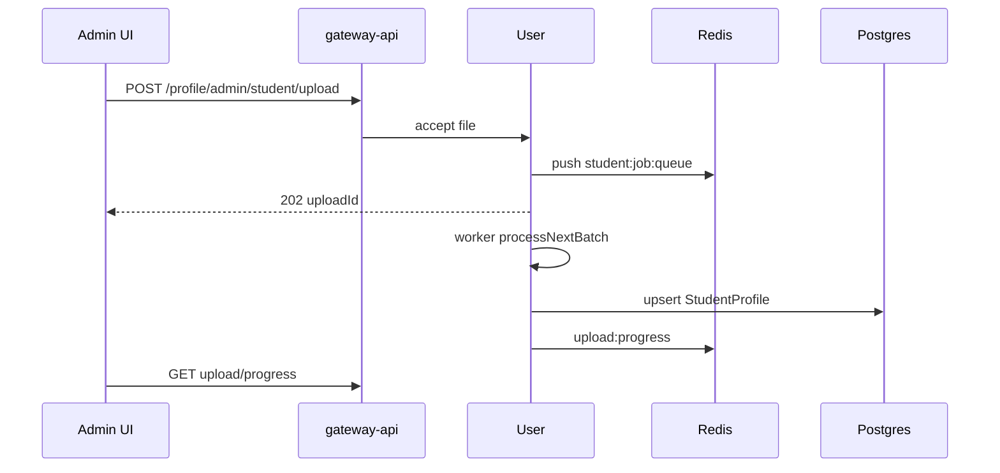

### Grades / attendance upload

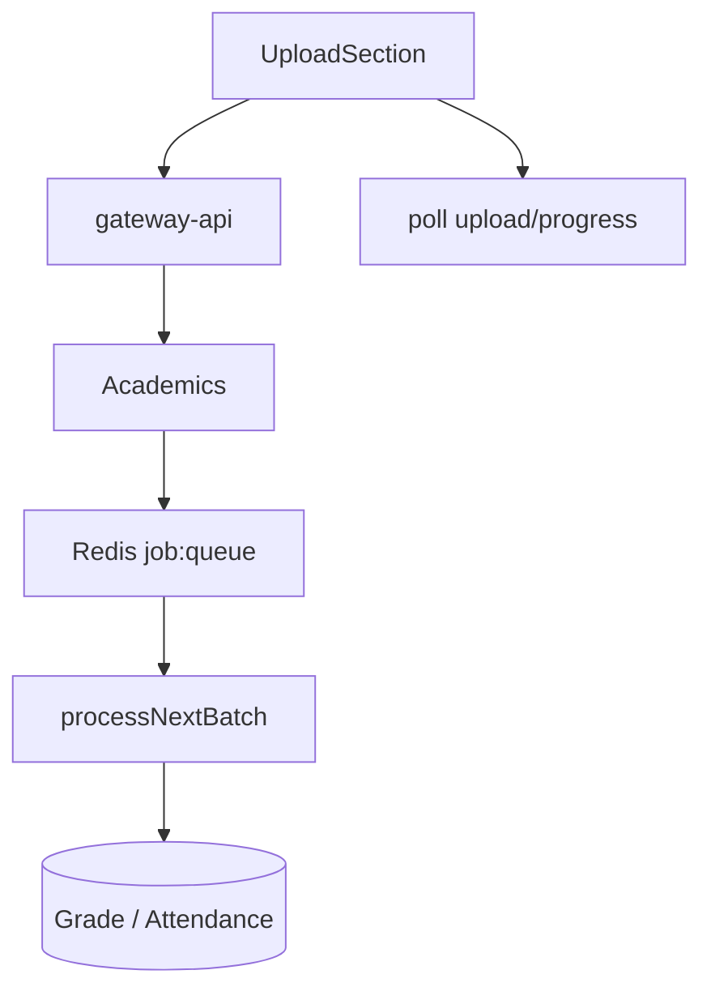

### Semester publish (OTP)

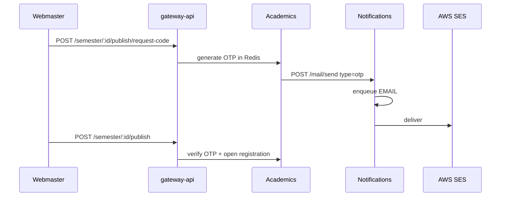

### Bulk registration PDF

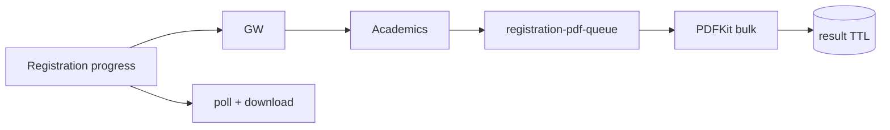

### Campus CMS and push

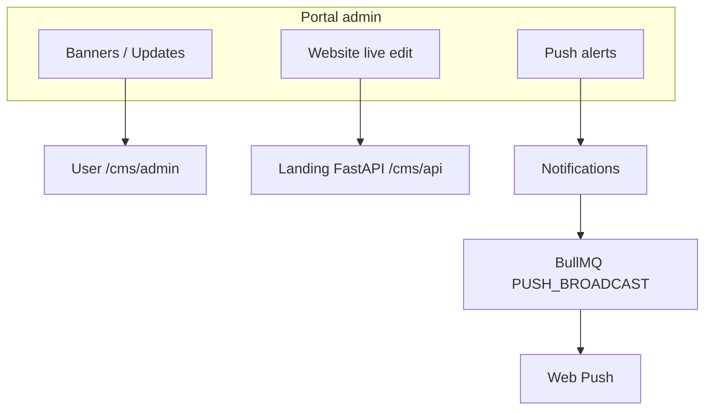

---

## HOD

Slim Dean shell: students (dept), semester approvals, registration tracking.

### Approve semester (HOD_REVIEW → next)

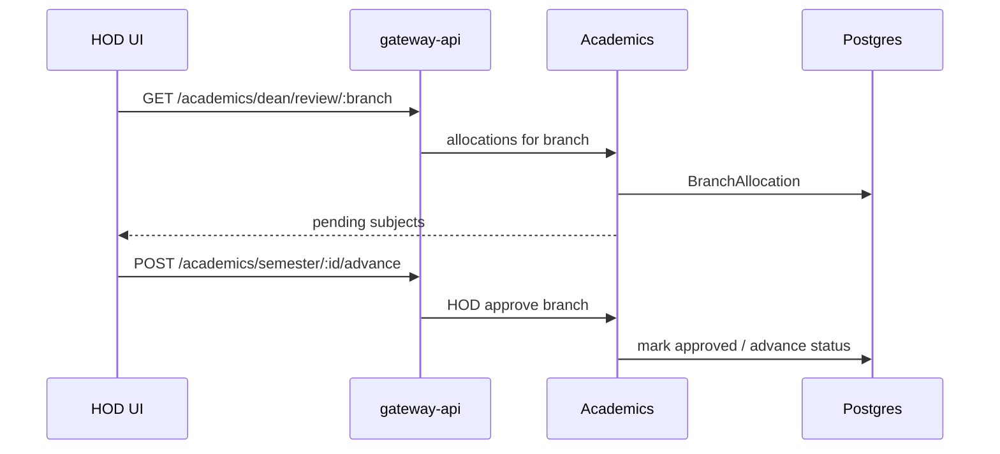

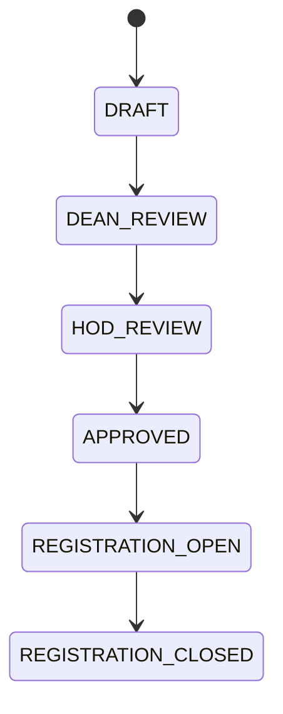

---

## Dean

Full academic + CMS tabs, plus semester approvals for all branches.

### Allocation review and approve

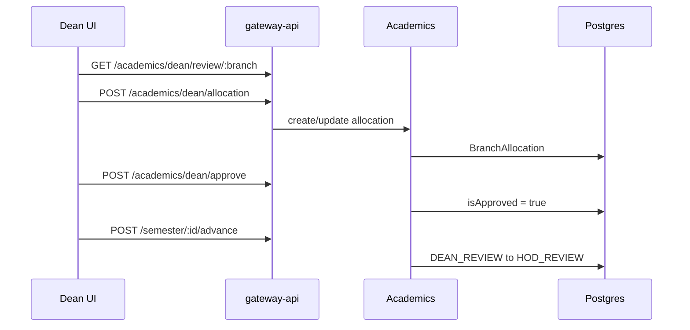

---

## SWO / Grievance

| Action | Endpoint | Service |
|--------|----------|---------|
| Student submit | `POST /grievance/submit` | User |
| SWO list | `GET /requests/grievance/list` | User (gateway rewrite) |
| Resolve | `PATCH /requests/grievance/:id/resolve` | User → SES |
| Delete | `DELETE /requests/grievance/:id` | User |

### Student submits grievance

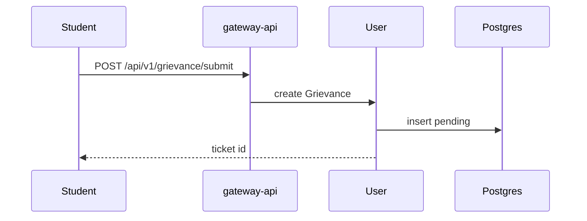

### SWO resolves grievance

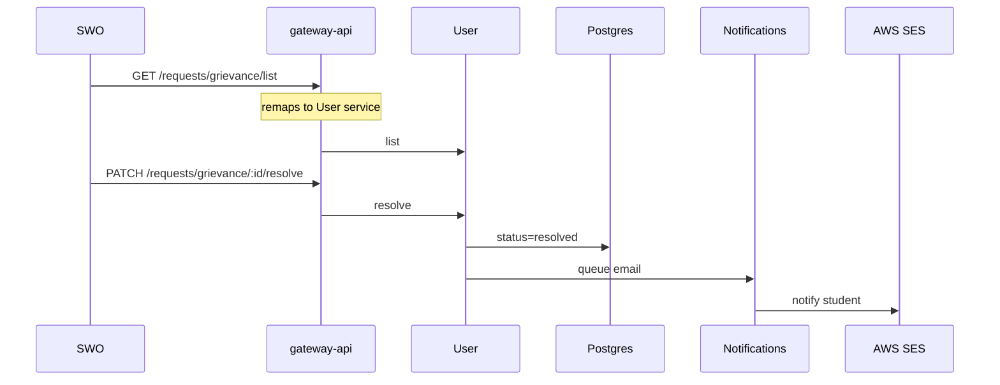

---

## Faculty

```mermaid
flowchart LR
  Login[Admin signin] --> FT[faculty_token]
  FT --> Dash[/faculty dashboard]
  Dash --> Me[GET /profile/faculty/me]
  Dash --> Search[POST /profile/student/search]
  Dash --> PW[POST /auth/password/change]
```

---

## Security / Caretaker / Warden

Outpass gate actions are **parked** unless `ENABLE_OUTPASS_OUTING=true`.

```mermaid
flowchart TB
  Sec[SecurityPortal] -->|flag on| OP[Outpass service]
  Care[Caretaker / Warden] -->|flag on| OP
  Care --> Status[PUT /profile/student/status]
  Status --> User
  OP --> PG[(Outpass / Outing)]
```

---

## Docs API (in-house docs)

VitePress static site, **not** Cloudflare Pages.

```mermaid
flowchart LR
  Browser --> CF[Cloudflare]
  CF --> API[api-uniz.rguktong.in/docs]
  API --> Traefik
  Traefik --> Docs[uniz-docs-service:3333]
  Docs --> VP[Static VitePress HTML]
```

| Item | Value |
|------|-------|
| Public URL | `https://api-uniz.rguktong.in/docs` |
| App | `apps/uniz-docs` |
| Gateway | proxies `/docs` → docs service |
| Local | `npm run docs:dev` (see package scripts) |

---

## Role → dashboard cheat sheet

| Role | Portal shell |
|------|----------------|
| student | `/student` |
| webmaster / coe | WebmasterDashboard |
| dean | DeanDashboard (full) |
| hod | DeanDashboard (slim) |
| director | DirectorDashboard |
| swo / dsw | SWODashboard |
| faculty | `/faculty` |
| security | SecurityPortal |
| caretaker_* / warden_* | Caretaker / Warden dashboards |
| ao / librarian | Generic admin hub (seeded) |
