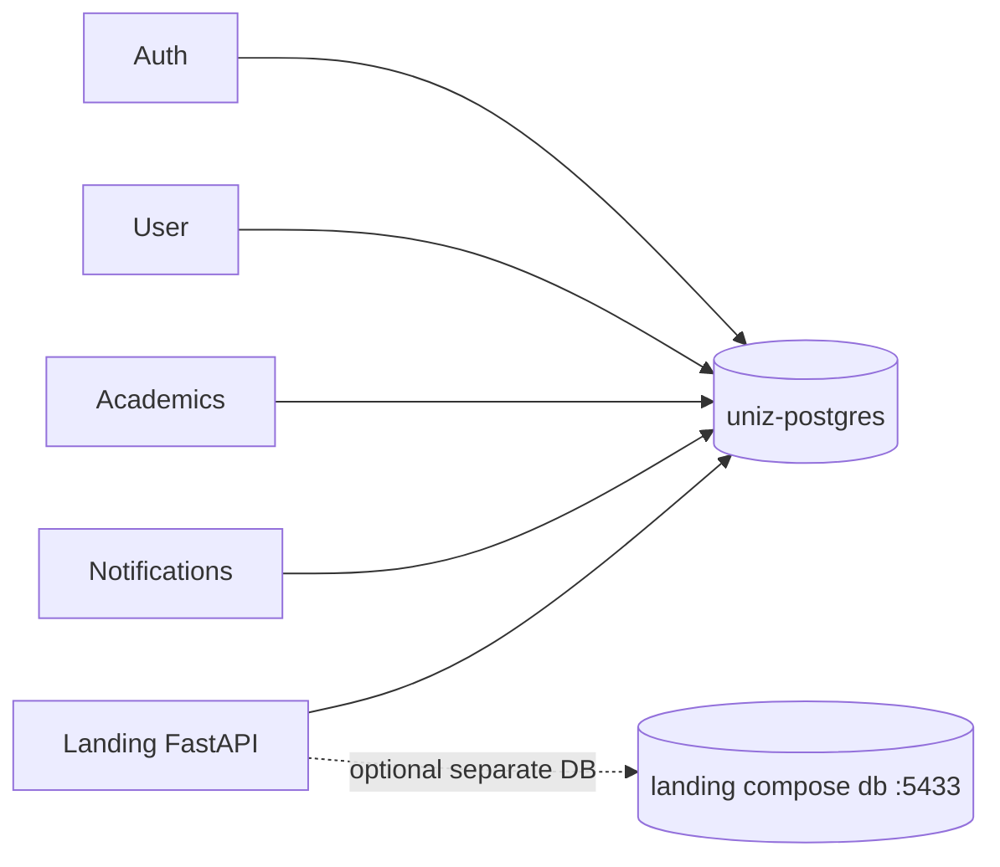

## Postgres

Production uses a **host Docker container** `uniz-postgres`, not an in-cluster Postgres pod. K8s Service `uniz-postgres` uses Endpoints pointed at the VPS IP (`postgres.yaml.template`).



| Consumer | Typical DB usage |
|----------|------------------|
| Auth | Users, credentials, OTP state |
| User | Profiles, CMS banners/notices, grievances, file metadata |
| Academics | Grades, attendance, subjects, semester registration |
| Notifications | Push subscriptions, inbox, mail attribution |
| Landing backend | CMS content; analytics may query main UniZ DB via `DB_*` |

Prisma schemas live per service under `apps/uniz-*/prisma/` (where applicable). Migrations: [Database migrations](/howto/database-migrations).

### Backup

```bash
bash scripts/ops/backup-postgres.sh
```

Also CronJob: `infra/kubernetes/base/core/postgres-backup-job.yaml`.

## Redis

Service URL (ConfigMap): `REDIS_URL=redis://uniz-redis:6379`.

| Use | Service |
|-----|---------|
| Gateway GET response cache | gateway-api |
| System health aggregate cache | gateway-api (`gateway:system_health_aggregate`) |
| BullMQ / job queues | academics, user (bulk), notifications |
| Rate / session helpers | auth / academics as implemented |

## Landing dual-DB note

Compose file `apps/uniz-landing-backend/docker-compose.yml.vps` may still run a dedicated Postgres on **:5433** for CMS (`DATABASE_URL`), while analytics uses host Postgres via `DB_HOST` (often `172.17.0.1`). Long-term lean target: single `uniz-postgres` with a separate `uniz_landing` database.
