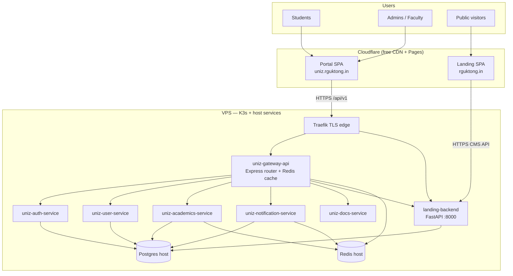

UniZ is a campus platform for RGUKT. **Frontends are static SPAs on Cloudflare Pages.** **APIs, Postgres, and Redis run on a single K3s VPS.** This page is the map; deeper pages cover topology, request flow, and each service.

## Big picture

## Design principles (current production)

| Principle | What it means in practice |
|-----------|---------------------------|
| Frontends off-box | Portal + landing never burn VPS CPU for HTML/JS |
| Thin edge | Traefik → **gateway-api only** (nginx hop parked) |
| Fold, don't multiply | Mail → notifications; files upload → user; grievance → user |
| Gate unused product | Outpass/outing off by flags; outpass Deployment at 0 |
| Burst with HPA, not always-on | Auth/user/academics/gateway-api scale on CPU/memory |

## Monorepo layout

| Path | Role |
|------|------|
| `apps/uniz-portal` | Student/admin/faculty SPA (Vite/React) |
| `apps/uniz-landing` | Public website SPA |
| `apps/uniz-landing-backend` | FastAPI CMS + analytics |
| `apps/uniz-gateway` | API gateway (Express) |
| `apps/uniz-auth` | Login / OTP / password |
| `apps/uniz-user` | Profiles, CMS notices, files, grievance |
| `apps/uniz-academics` | Grades, attendance, registration |
| `apps/uniz-notifications` | Push, inbox, mail |
| `apps/uniz-docs` | This Mintlify site |
| `apps/uniz-outpass` | Outpass/outing (parked in prod) |
| `packages/uniz-shared` | Shared TypeScript types/utils |
| `infra/core-infra/kubernetes` | K3s manifests (source of truth for replicas) |
| `scripts/deploy`, `scripts/ops` | Deploy + runbooks |

## Read next

- **[Production topology](/system/topology)**

  - **[Request flow](/system/request-flow)**

  - **[Gateway service](/services/gateway)**

  - **[Search index](/search-index)**
