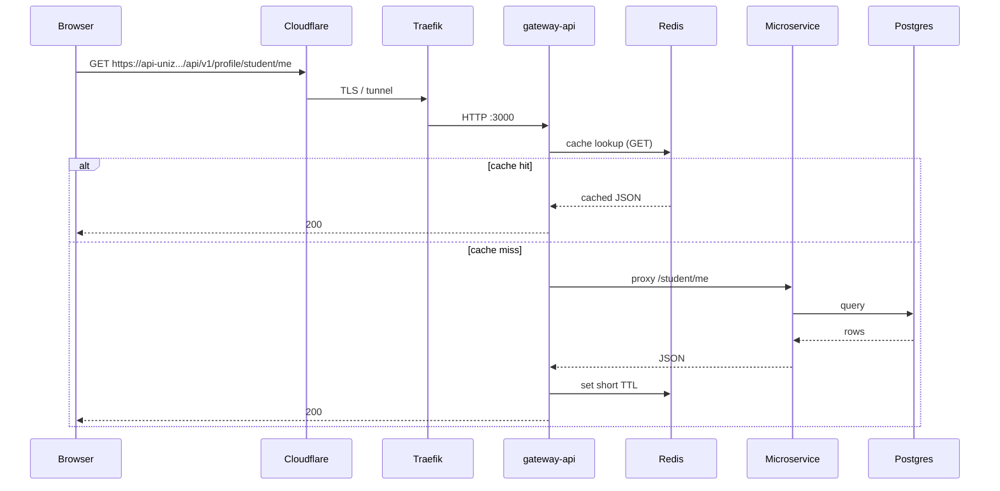
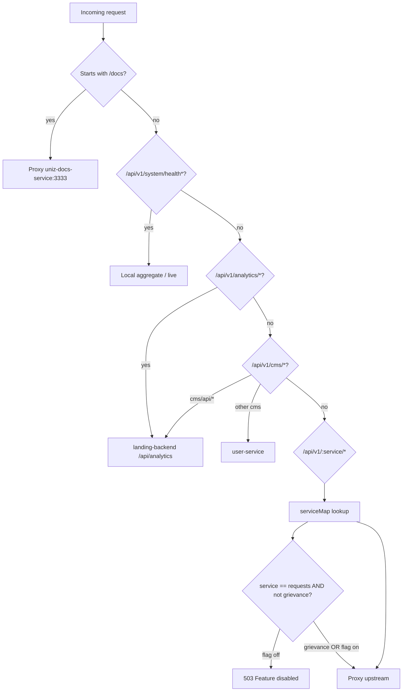

## Happy path (portal API)

## Gateway decision tree

Implemented in `apps/uniz-gateway/src/index.ts`.

## Path → upstream (serviceMap)

| Public prefix | Upstream (default) | Notes |
|---------------|--------------------|--------|
| `/api/v1/auth/*` | `uniz-auth-service:3001` | |
| `/api/v1/profile/*` | `uniz-user-service:3002` | |
| `/api/v1/cms/*` | user (except `/cms/api/*` → landing) | |
| `/api/v1/academics/*` | `uniz-academics-service:3004` | |
| `/api/v1/notifications/*` | `uniz-notification-service:3007` | |
| `/api/v1/mail/*` | notifications `:3007` | Folded |
| `/api/v1/files/*` | user `:3002` | Folded |
| `/api/v1/grievance/*` | user `:3002` | |
| `/api/v1/requests/*` | outpass `:3003` | **503** unless `ENABLE_OUTPASS_OUTING=true` |
| `/api/v1/requests/.../grievance*` | **forced to user** | Works while outpass parked |
| `/api/v1/analytics/*` | landing-backend | |
| `/docs` | `uniz-docs-service:3333` | |

## Portal build-time API base

Portal resolves absolute API URL at build time:

- Production Pages: `VITE_API_URL=https://api-uniz.rguktong.in/api/v1`
- Code: `apps/uniz-portal/src/api/endpoints.ts` (`resolveApiBaseUrl`)

Landing uses `VITE_LANDING_API_URL=https://landing-api.rguktong.in`.

## CORS

Gateway applies CORS from `CLIENT_URL` (comma-separated). Production includes `https://uniz.rguktong.in`. Landing CMS has its own CORS for `https://rguktong.in`.
