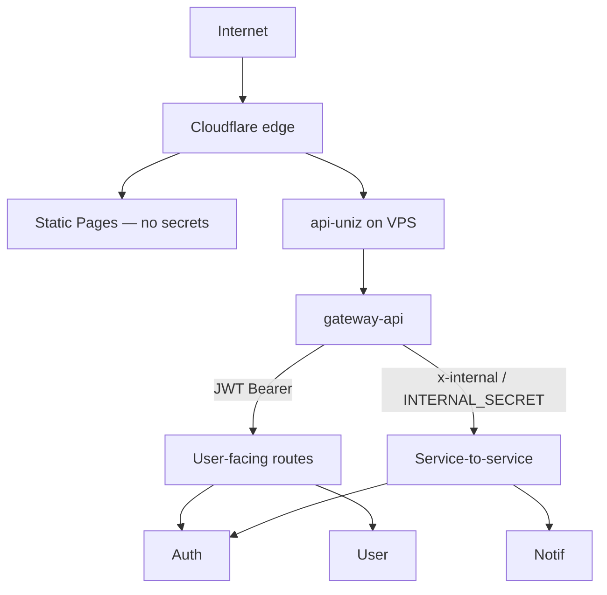

## Trust boundaries

## Authentication

| Mechanism | Where |
|-----------|--------|
| JWT (`JWT_SECURITY_KEY`) | Issued by auth; validated by services + gateway as needed |
| Role claims | Student / faculty / admin / security / etc. — see [Roles](/roles) |
| Turnstile | Login/abuse paths when `TURNSTILE_SECRET_KEY` / `VITE_TURNSTILE_SITE_KEY` set |
| Internal secret | `INTERNAL_SECRET` for `/internal/*` and mail send |

## Secrets management

- VPS: `/root/uniz-secrets.env` (never commit)
- GitHub Actions: repository secrets for CI/deploy/Pages
- Helpers: `scripts/ops/vps-vault.sh`, `scripts/deploy/render-vps-secrets.sh`
- Example keys: `secrets.env.example`

## CORS

- Gateway: `CLIENT_URL` comma list (must include Pages origin `https://uniz.rguktong.in`)
- Landing API: allowlist includes `https://rguktong.in`

## Network

- Origin IP preferably behind Cloudflare Tunnel (`scripts/deploy/setup-cloudflare-tunnel.sh`) — tunnel hosts are **API only** (`api-uniz`, `landing-api`), not portal/landing (those are Pages)
- Ingress TLS via cert-manager DNS-01 with Cloudflare token

## What not to put in the frontend

Vite `VITE_*` values are **public**. Never put `JWT_SECURITY_KEY`, DB URLs, or `INTERNAL_SECRET` in portal/landing builds.
