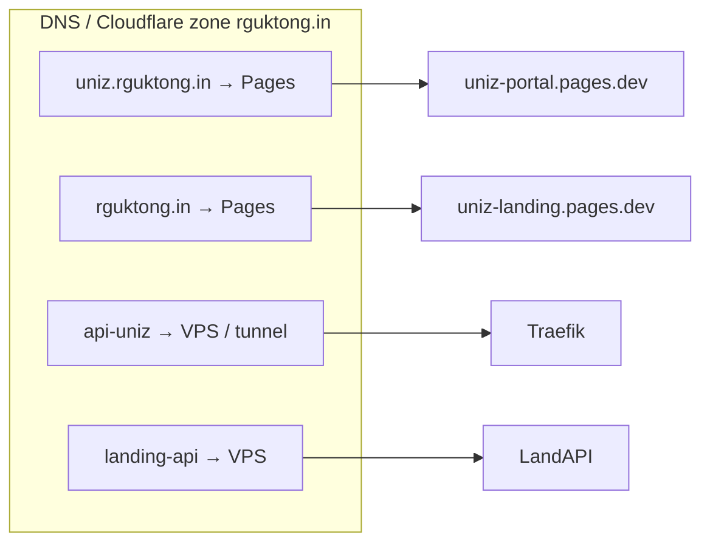
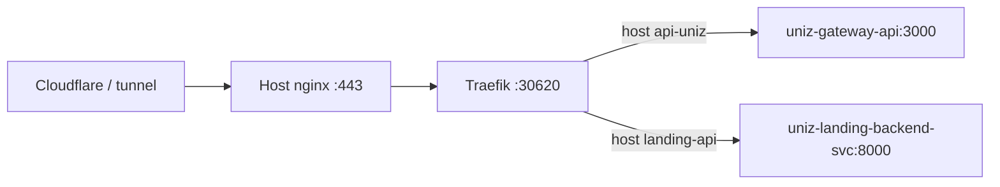

Canonical ops doc in the repo: [`docs/architecture/PRODUCTION_TOPOLOGY.md`](https://github.com/uniz-rguktong/uniz-master/blob/main/docs/architecture/PRODUCTION_TOPOLOGY.md). Manifests under `infra/core-infra/kubernetes/base/`.

## Hosts

| Layer | Where | Hostname |
|-------|--------|----------|
| Portal SPA | Cloudflare Pages | `https://uniz.rguktong.in` |
| Landing SPA | Cloudflare Pages | `https://rguktong.in` |
| API | VPS Traefik → gateway-api | `https://api-uniz.rguktong.in` |
| Landing CMS API | VPS (Docker compose on host) | `https://landing-api.rguktong.in` |
| Docs (Mintlify) | VPS pod, proxied by gateway | `https://api-uniz.rguktong.in/docs` |
| Postgres | VPS host container `uniz-postgres` | internal (`uniz-postgres:5432` Endpoints) |
| Redis | VPS / cluster Service | `redis://uniz-redis:6379` |

## Always-on VPS Deployments

| Deployment | Min | Max (HPA) | Notes |
|------------|-----|-----------|--------|
| `uniz-gateway-api` | 1 | 2 | Express router + Redis cache |
| `uniz-auth-service` | 1 | 2 | Login |
| `uniz-user-service` | 1 | 4 | Profiles, CMS, files, grievance |
| `uniz-academics-service` | 1 | 3 | Grades, attendance, registration |
| `uniz-notification-service` | 1 | — | Push + inbox + mail |
| `uniz-docs-service` | 1 | — | Mintlify (this site) |
| `uniz-redis` | 1 | — | Cache / queues |

Landing FastAPI runs as **Docker Compose on the host**, exposed into the cluster via Endpoints Service `uniz-landing-backend-svc:8000`.

## Parked (replicas 0)

| Deployment | Why |
|------------|-----|
| `uniz-gateway` (nginx) | Traefik talks to gateway-api directly |
| `uniz-portal` / `uniz-landing` | Served from Cloudflare Pages |
| `uniz-outpass-service` | Feature gated; grievance moved to user |
| `uniz-mail-service` | Folded into notifications |
| `uniz-files-service` | Folded into user |
| `uniz-cron-service` | CronJob-only (no always-on Deploy) |

CI belt-and-suspenders: `scripts/ci/ci-remote-deploy.sh` re-scales these to 0 after every successful VPS deploy.

## Ingress (Kubernetes)

File: `infra/core-infra/kubernetes/base/shared/ingress.yaml`

- `ingressClassName: nginx` (Traefik emulates NGINX Ingress provider)
- TLS via cert-manager + Cloudflare DNS challenge (`letsencrypt-prod-dns`)

## Capacity note (4 vCPU)

Idle always-on app pods are intentionally lean. HPA max is for **short bursts** (results day), not sustained 1k RPS. Bottleneck order: Postgres → academics/auth CPU → Redis only under queue pressure.

See [Scale & HPA](/howto/scale-and-hpa).
