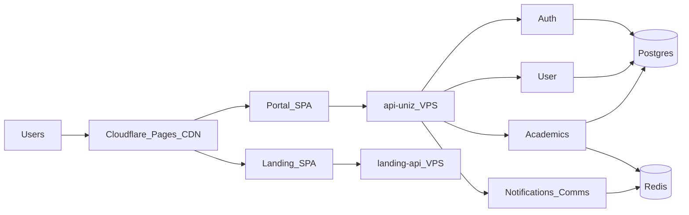

# UniZ Production Topology & Scaling

**Source of truth:** this doc + Kubernetes manifests under `infra/core-infra/kubernetes/base/`.

## Where things run

| Layer | Where | Hosts |
|-------|--------|--------|
| **Portal SPA** | Cloudflare Pages (free CDN) | `uniz.rguktong.in` |
| **Landing SPA** | Cloudflare Pages (free CDN) | `rguktong.in` |
| **API gateway + services** | VPS (K3s) | `api-uniz.rguktong.in` |
| **Landing CMS API** | VPS | `landing-api.rguktong.in` |
| **Postgres + Redis** | VPS | internal only |



## Always-on VPS services

| Deployment | Replicas | Notes |
|------------|----------|-------|
| uniz-gateway / gateway-api | HPA | Edge proxy + cache |
| uniz-auth-service | HPA | Login |
| uniz-user-service | HPA | Profiles, CMS notices, files upload, grievance |
| uniz-academics-service | HPA | Grades, attendance, registration |
| uniz-notification-service | 1 | Push + mail (comms) |
| landing-backend | 1 | FastAPI for website CMS |

## Parked on VPS (replicas 0)

| Unit | Why |
|------|-----|
| uniz-portal | Served from Cloudflare Pages |
| uniz-landing | Served from Cloudflare Pages |
| uniz-outpass-service | Outpass/outing gated; grievance on user |
| uniz-mail / uniz-files / uniz-cron Deploy | Folded / CronJob-only |

## Frontend deploy

```bash
# CI: .github/workflows/deploy-cloudflare-pages.yml
# Manual:
CLOUDFLARE_API_TOKEN=... bash scripts/deploy/deploy-cloudflare-pages.sh
```

Build env:
- Portal: `VITE_API_URL=https://api-uniz.rguktong.in/api/v1`
- Landing: `VITE_LANDING_API_URL=https://landing-api.rguktong.in`

## Feature flags

| Flag | Default | Effect |
|------|---------|--------|
| `VITE_ENABLE_OUTPASS_OUTING` | false | Portal outpass UI |
| `ENABLE_OUTPASS_OUTING` | false | Gateway `/requests` (non-grievance) |
| `VITE_MAINTENANCE_MODE` | false | Portal maintenance page |

## Ops

```bash
bash scripts/ops/post-deploy-smoke.sh
bash scripts/ops/backup-postgres.sh
kubectl get deploy,hpa
```
