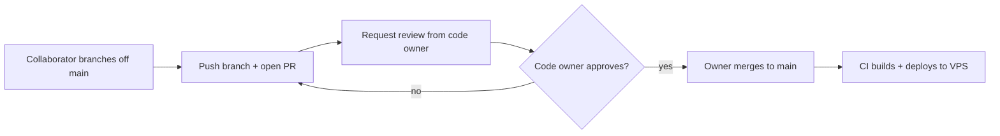

# GitHub governance — reviews, merges, and access

This repo is set up so that **contributors propose changes via pull requests and
only an approved reviewer can merge them**. This page documents the exact policy,
who can do what, and how the owner grants authority over time.

## TL;DR

- Collaborators push **branches** and open **pull requests** to `main`.
- Every PR needs an **approving review from a code owner** (see
  [`.github/CODEOWNERS`](../../.github/CODEOWNERS)).
- **Only maintainers with push access to `main` can merge** — currently the
  owner only. Contributors cannot merge their own PRs.
- The owner can grant review/merge authority to anyone (see
  [Granting merge authority](#granting-merge-authority)).

## Roles

| GitHub access | Who | Can do |
|---------------|-----|--------|
| Admin (owner) | `@sreecharan-desu` | Everything: review, approve, merge, change settings, grant access |
| Maintain / Write (collaborators) | juniors added by the owner | Push branches, open PRs, comment/review, but **cannot merge to `main`** |

## The workflow



1. `git checkout -b feature/x` off `main`.
2. Push the branch and open a PR (the PR template loads automatically).
3. Request a review from `@sreecharan-desu`.
4. The owner reviews; new commits dismiss stale approvals, so re-request if you
   push again.
5. Once approved and CI is green, the owner merges. The merge triggers the
   automatic VPS deploy.

## Branch protection on `main` (current settings)

These are enforced on `main` (Settings → Branches → `main`):

- **Require a pull request before merging** — yes.
- **Required approving reviews** — 1.
- **Require review from Code Owners** — yes (so `@sreecharan-desu`'s approval is
  required, per `.github/CODEOWNERS`).
- **Dismiss stale approvals on new commits** — yes.
- **Require conversation resolution before merging** — yes.
- **Restrict who can push (and therefore merge) to `main`** — `@sreecharan-desu`
  only.
- **Do not allow force pushes / deletions** — enforced.
- **Include administrators** — off, so the owner retains an override to merge or
  hotfix when necessary.

## Adding a collaborator

Owner only, in the GitHub UI:

1. **Settings → Collaborators and teams → Add people**.
2. Enter the GitHub username and pick a role:
   - **Write** — can push branches and open PRs (recommended for juniors).
   - **Maintain** — Write plus manage issues/PRs and some repo settings.
3. The invitee accepts the emailed invitation.

New collaborators can immediately open PRs, but still cannot merge to `main`.

## Granting merge authority

To let someone approve **and** merge (i.e. act as a reviewer/merger):

1. Add their username to [`.github/CODEOWNERS`](../../.github/CODEOWNERS):
   ```
   *       @sreecharan-desu @their-username
   ```
   (Commit via a PR — this itself requires owner approval.)
2. Add their username to the **push restriction** on `main` so they can perform
   the merge:
   - **Settings → Branches → `main` → Restrict who can push → Add** the user.
   - Or via CLI:
     ```bash
     # append a user to the allowed pushers on main
     gh api -X POST repos/uniz-rguktong/uniz-master/branches/main/protection/restrictions/users \
       -f "users[]=their-username"
     ```

To revoke, remove them from both places.

## Notes for maintainers

- CI (build + typecheck) runs on every PR to `main`; keep it green before merge.
- Squash or merge-commit is fine; force-push to `main` is blocked.
- Secrets live in GitHub Actions repo secrets and on the VPS
  (`/root/uniz-secrets.env`) — never in the repo. See `apps/uniz-docs/system/security.md`.
